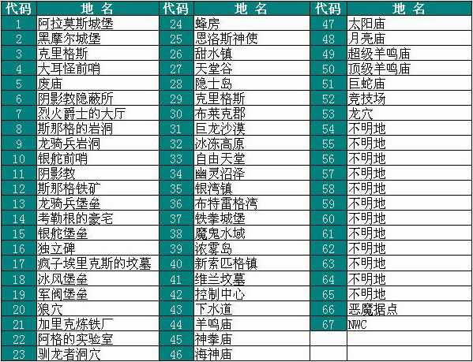
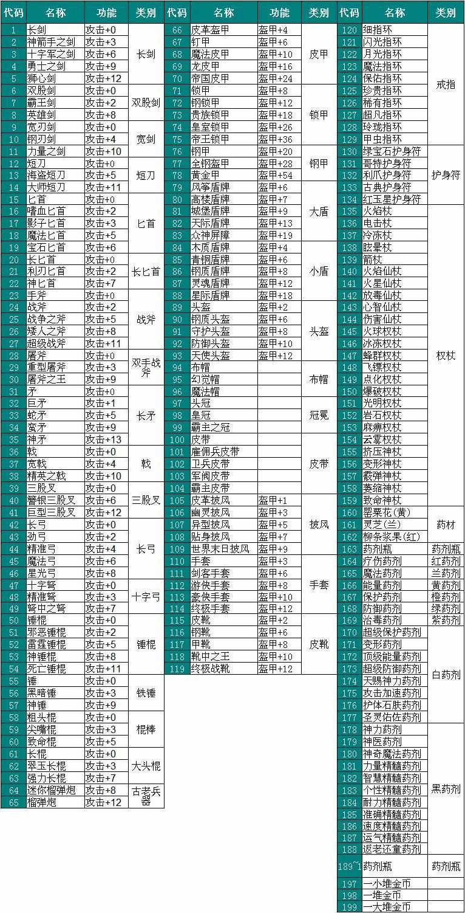
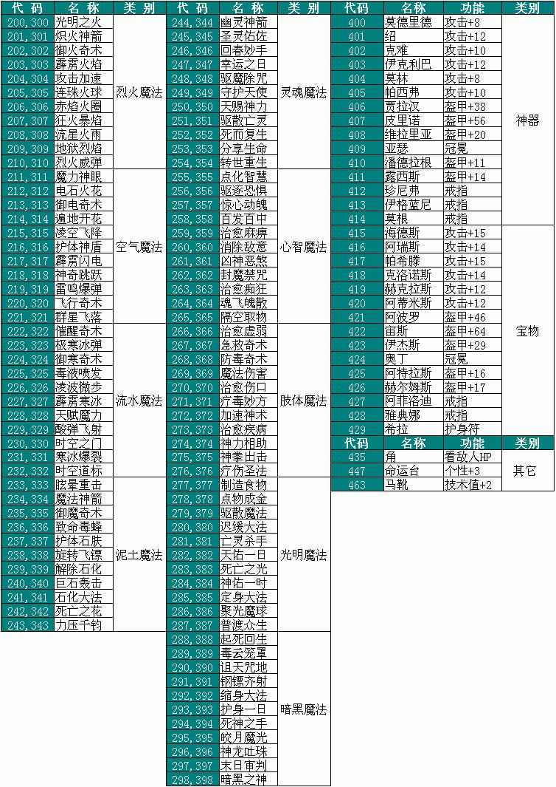

.. _游戏作弊码:

游戏作弊码
==============================================================================

J, W, F, E, F2, F6在魔法门中可谓是人尽皆知的秘籍。以下详细解说了这些秘籍的功能。

.. _J键用途:

J键用途 (地图和地下城传送)
------------------------------------------------------------------------------
在游戏中按下J键, 再输入以下数字然后按Enter键, 能直接传送至各个地图和地下城场景。

**注: 玩家使用J命令传送到某个地图, 地图上怪物的刷新状态会刷新至最近一次存档的状态.**

.. note::

    无限刷怪技巧:

    在第一次进入一个新地图或新地下城时, 进行存档. 每次进行战斗杀死怪物后, 用J命令传送至该地图, 则所有怪物宝箱刷新.

.. _城镇地图传送:

城镇地图
~~~~~~~~~~~~~~~~~~~~~~~~~~~~~~~~~~~~~~~~~~~~~~~~~~~~~~~~~~~~~~~~~~~~~~~~~~~~~~

- **J 40**: :ref:`新索匹格`
- **J 37**: :ref:`铁拳城堡`
- **J 35**: :ref:`银湾镇`
- **J 39**: :ref:`浓雾岛`
- **J 33**: :ref:`自由天堂`
- **J 30**: :ref:`布莱克郡`
- **J 32**: :ref:`冰冻高原`
- J 36: :ref:`布特雷格湾`
- J 26: :ref:`甜水镇`
- J 27: :ref:`天堂谷`
- J 28: :ref:`隐士岛`
- J 29: :ref:`克里格斯`
- J 31: :ref:`飞龙沙漠`
- J 34: :ref:`幽灵沼泽`
- J 38: :ref:`魔鬼水域`

.. _地下城地图传送:

地下城地图
~~~~~~~~~~~~~~~~~~~~~~~~~~~~~~~~~~~~~~~~~~~~~~~~~~~~~~~~~~~~~~~~~~~~~~~~~~~~~~

- J 1: :ref:`阿拉莫斯城堡`
- J 2: :ref:`黑摩尔城堡`
- J 3: :ref:`克里格斯城堡`
- J 4: :ref:`大耳怪前哨`
- J 5: :ref:`废庙`
- J 6: :ref:`阴影教隐蔽所`
- J 7: :ref:`烈火爵士大厅`
- J 8: :ref:`斯那格的岩洞`
- J 9: :ref:`龙骑兵岩洞`
- J 10: :ref:`银舵前哨`
- J 11: :ref:`阴影教`
- J 12: :ref:`斯那格铁矿`
- J 13: :ref:`龙骑兵堡垒`
- J 14: :ref:`考勒根的豪宅`
- J 15: :ref:`银舵堡垒`
- J 16: :ref:`独立碑`
- J 17: :ref:`疯子埃斯里克的坟墓`
- J 18: :ref:`冰风堡垒`
- J 19: :ref:`军阀堡垒`
- J 20: :ref:`狼穴`
- J 21: :ref:`加里克冶炼厂`
- J 22: :ref:`阿加的实验室`
- J 23: :ref:`驯龙者洞穴`
- J 24: :ref:`蜂房`
- J 25: :ref:`恩洛斯神使`
- J 41: :ref:`维兰坟墓`
- J 42: :ref:`控制中心`
- J 43: :ref:`自由天堂下水道`
- J 44: :ref:`羊鸣庙`
- J 45: :ref:`神拳庙`
- J 46: :ref:`海神庙`
- J 47: :ref:`太阳庙`
- J 48: :ref:`月亮庙`
- J 49: :ref:`超级羊鸣庙`
- J 50: :ref:`顶级羊鸣庙`
- J 51: :ref:`巨蛇庙`
- J 52: :ref:`竞技场`
- J 53: :ref:`龙穴`
- J 54: 不明地
- J 55: 不明地
- J 56: 不明地
- J 57: 不明地
- J 58: 不明地
- J 59: 不明地
- J 60: 不明地
- J 61: 不明地
- J 62: 不明地
- J 63: 不明地
- J 64: 不明地
- J 65: 不明地
- J 66: :ref:`恶魔据点`
- J 67: :ref:`NewWorldComputing` (New World Computing 游戏制作组总部彩蛋)

.. _W键用途:

W键用途 (房屋场景)
------------------------------------------------------------------------------
在游戏中按下W键, 再输入以下数字然后按Enter键, 能直接传送至各个房屋场景。

.. _城镇房屋传送:

城镇房屋
~~~~~~~~~~~~~~~~~~~~~~~~~~~~~~~~~~~~~~~~~~~~~~~~~~~~~~~~~~~~~~~~~~~~~~~~~~~~~~
兵器, 铠甲, 魔法物品商店, 杂货店。**注: W1, W15, W29分是新索匹格的兵器, 铠甲, 魔法物品商店。卖东西在这几个地方卖最划算**。

- 1～14: 各类兵器屋
- 15～28: 各类铠甲屋
- 29～41: 各类魔法饰物屋
- 42～47: 各类杂货店 (出售装备道具, 虽然方便, 但是出售的价格不如兵器, 铠甲, 魔法用品店)

旅行驿站码头:

- 48～56: 各家驿站
- 57～68: 各家码头

其他:

- 69～78: 各家寺庙 (战斗中随时治疗痊愈)。**注: W69是新索匹格的神庙, 最为便宜**。
- 79～88: **各家训练馆**。**注: 各训练馆的升级费率和上限以及传送代码请参考** :ref:`等级训练`。
- 89～112: 各家旅馆

- 113～118: 各家银行
- 119～140: 各家魔法门派 (为了获得需要的魔法书, 可能要多次SL)
- 141～152: 各地镇公所及行会

- 169: 先知, 每个月拜访神庙加永久属性点之前需拜访先知, 位于 :ref:`铁拳城堡` 地图的山上。
- 170: 恩洛斯神使

行会教派
~~~~~~~~~~~~~~~~~~~~~~~~~~~~~~~~~~~~~~~~~~~~~~~~~~~~~~~~~~~~~~~~~~~~~~~~~~~~~~

- W 268: 加入保护者行会 (冰冻高原地图右下方城镇的下方)
- W 258: 加入走私者行会 (布莱克郡右边)
- W 274: 加入终极利刃 (新索匹格右下)
- W 278: 加入元素教派 (新索匹格右上)
- W 287: 加入双刃剑锋行会 (浓雾岛左上)
- W 369: 加入自我教派 (新索匹格右上)
- W 457: 加入海盗之巢行会 (新索匹格右下)
- W XXX: 加入雷霆震怒 (铁拳城堡城下)

魔法行会
~~~~~~~~~~~~~~~~~~~~~~~~~~~~~~~~~~~~~~~~~~~~~~~~~~~~~~~~~~~~~~~~~~~~~~~~~~~~~~

- W 288: 加入烈火教派 (浓雾岛下方)
- W 289: 加入空气教派 (浓雾岛下方)
- W 290: 加入流水教派 (浓雾岛下方)
- W 291: 加入泥土教派 (自由天堂右下方)
- W 292: 加入灵魂教派 (铁拳城堡城堡区)
- W 293: 加入心智教派 (铁拳城堡城堡区)
- W 294: 加入肢体教派 (铁拳城堡城堡区)
- W 367: 加入光明教派 (布莱克郡右上)
- W 255: 加入暗黑教派 (布莱克郡右上)

.. _武器专家大师传送:

武器专家大师
~~~~~~~~~~~~~~~~~~~~~~~~~~~~~~~~~~~~~~~~~~~~~~~~~~~~~~~~~~~~~~~~~~~~~~~~~~~~~~
注: **有些武器技能是达到一定条件后找特定NPC习得的, 故不出现在W键列表中**。具体请参考 :ref:`训练与升级` 一章

具体升级方式请参考 :ref:`武器类技能训练 <武器类技能训练>`。

弓箭
++++++++++++++++++++++++++++++++++++++++++++++++++++++++++++++++++++++++++++++

- W 438: 弓箭专家
- W 241: 弓箭大师

剑
++++++++++++++++++++++++++++++++++++++++++++++++++++++++++++++++++++++++++++++

- W 428: 剑专家
- W 250: 剑大师

匕首
++++++++++++++++++++++++++++++++++++++++++++++++++++++++++++++++++++++++++++++

- W 322: 匕首专家
- W 271: 匕首大师

矛
++++++++++++++++++++++++++++++++++++++++++++++++++++++++++++++++++++++++++++++

- W 461: 矛专家
- W 339: 矛大师

斧
++++++++++++++++++++++++++++++++++++++++++++++++++++++++++++++++++++++++++++++

- W 340: 斧专家

锤
++++++++++++++++++++++++++++++++++++++++++++++++++++++++++++++++++++++++++++++

- W 270: 锤专家
- W 252: 锤大师

棍
++++++++++++++++++++++++++++++++++++++++++++++++++++++++++++++++++++++++++++++

- W 460: 棍专家

古老兵器
++++++++++++++++++++++++++++++++++++++++++++++++++++++++++++++++++++++++++++++

- W 478: 古兵器(榴弹枪) 专家

.. _防具专家大师传送:

防具专家大师
~~~~~~~~~~~~~~~~~~~~~~~~~~~~~~~~~~~~~~~~~~~~~~~~~~~~~~~~~~~~~~~~~~~~~~~~~~~~~~
具体升级方式请参考 :ref:`防具类技能训练 <防具类技能训练>`。

盾牌
++++++++++++++++++++++++++++++++++++++++++++++++++++++++++++++++++++++++++++++

- W 434: 盾牌专家
- W 248: 盾牌大师

皮甲
++++++++++++++++++++++++++++++++++++++++++++++++++++++++++++++++++++++++++++++

- W 435: 皮甲专家
- W 272: 皮甲大师

锁甲
++++++++++++++++++++++++++++++++++++++++++++++++++++++++++++++++++++++++++++++

- W 414: 锁甲专家
- W 335: 锁甲大师

钢甲
++++++++++++++++++++++++++++++++++++++++++++++++++++++++++++++++++++++++++++++

- W 298: 钢甲专家
- W 299: 钢甲大师

.. _魔法专家大师传送:

魔法专家大师
~~~~~~~~~~~~~~~~~~~~~~~~~~~~~~~~~~~~~~~~~~~~~~~~~~~~~~~~~~~~~~~~~~~~~~~~~~~~~~
具体升级方式请参考 :ref:`魔法类技能训练 <魔法类技能训练>`。

烈火
++++++++++++++++++++++++++++++++++++++++++++++++++++++++++++++++++++++++++++++

- W 465: 烈火魔法专家
- W 455: 烈火魔法大师

空气
++++++++++++++++++++++++++++++++++++++++++++++++++++++++++++++++++++++++++++++

- W 326: 空气魔法专家
- W 458: 空气魔法大师

流水
++++++++++++++++++++++++++++++++++++++++++++++++++++++++++++++++++++++++++++++

- W 477: 流水魔法专家
- W 459: 流水魔法大师

泥土
++++++++++++++++++++++++++++++++++++++++++++++++++++++++++++++++++++++++++++++

- W 466: 泥土魔法专家
- W 396: 泥土魔法大师

灵魂
++++++++++++++++++++++++++++++++++++++++++++++++++++++++++++++++++++++++++++++

- W 467: 灵魂魔法专家
- W 426: 灵魂魔法大师

心智
++++++++++++++++++++++++++++++++++++++++++++++++++++++++++++++++++++++++++++++

- W 468: 心智魔法专家
- W 401: 心智魔法大师

肢体
++++++++++++++++++++++++++++++++++++++++++++++++++++++++++++++++++++++++++++++

- W 469: 肢体魔法专家
- W 402: 肢体魔法大师

光明
++++++++++++++++++++++++++++++++++++++++++++++++++++++++++++++++++++++++++++++

- W 239: 光明魔法专家
- W 444: 光明魔法大师

暗黑
++++++++++++++++++++++++++++++++++++++++++++++++++++++++++++++++++++++++++++++

- W 273: 暗黑魔法专家
- W 216: 暗黑魔法大师

.. _辅助技术专家大师传送:

辅助技术专家大师
~~~~~~~~~~~~~~~~~~~~~~~~~~~~~~~~~~~~~~~~~~~~~~~~~~~~~~~~~~~~~~~~~~~~~~~~~~~~~~
具体升级方式请参考 :ref:`辅助类技能训练 <辅助类技能训练>`。

修补术
++++++++++++++++++++++++++++++++++++++++++++++++++++++++++++++++++++++++++++++

- W 462: 修补术专家
- W 277: 修补术大师

冥想术
++++++++++++++++++++++++++++++++++++++++++++++++++++++++++++++++++++++++++++++

- W 408: 冥想术专家
- W 456: 冥想术大师

健身术
++++++++++++++++++++++++++++++++++++++++++++++++++++++++++++++++++++++++++++++

- W 440: 健身术专家
- W 284: 健身术大师

鉴定术
++++++++++++++++++++++++++++++++++++++++++++++++++++++++++++++++++++++++++++++

- W 429: 鉴定术专家
- W 285: 鉴定术大师

学习术
++++++++++++++++++++++++++++++++++++++++++++++++++++++++++++++++++++++++++++++

- W 424: 学习术专家
- W 407: 学习术大师

拆卸术
++++++++++++++++++++++++++++++++++++++++++++++++++++++++++++++++++++++++++++++

- W 430: 拆卸术专家
- 2W 75: 拆卸术大师

经商术
++++++++++++++++++++++++++++++++++++++++++++++++++++++++++++++++++++++++++++++

- W 303: 经商术专家
- W 397: 经商术大师

洞察术
++++++++++++++++++++++++++++++++++++++++++++++++++++++++++++++++++++++++++++++

- W 415: 洞察术专家
- W 336: 洞察术大师

交际术
++++++++++++++++++++++++++++++++++++++++++++++++++++++++++++++++++++++++++++++

- W 304: 交际术专家
- W 276: 交际术大师

.. _随从雇佣作弊码:

各种随从
~~~~~~~~~~~~~~~~~~~~~~~~~~~~~~~~~~~~~~~~~~~~~~~~~~~~~~~~~~~~~~~~~~~~~~~~~~~~~~

各类随从的功能可以在 :ref:`随从技能和花费` 一节中找到.

特殊技能:

- W 261: 护门大师, 时空之门
- W 262: 呼风大师, 飞行奇术
- W 262: 引水大师, 凌波微步

拆卸:

- W 353: 补锅匠, 拆卸+4
- W 393: 锁匠, 拆卸+6

获得的金币:

- W 418: 代理商, 获得的金币+10%
- W 227: 银行家, 获得的金币+20%

经验:

- W 212: 学者, 鉴定, 经验+5%
- W 246: 教师, 经验+10%
- W 235: 导师, 经验+15%

经商术:

- W 264: 商人, 经商术+4
- W 260: 经商术, 经商术+6
- W 311: 骗子, 经商术+6, 降声望

治疗:

- W 222: 医师
- W 237: 医术专家
- W 242: 医术大师
- W 265: 医术大师

兵器盔甲技能:

- W 264: 兵器大师, 兵器技能+3
- W 419: 仆从, 兵器和盔甲技能+2
- W 265: 点化师, 元素抗力+10

魔法技能:

- W 421: 学徒, 魔法技能+2
- W 308: 神秘人, 魔法技能+3
- W 261: 魔法大师, 魔法技能+4
- W 310: 侦察员, 洞察+6

声望:

- W 328: 诗人, 加速声望发展

旅行:

- W 217: 引路人, 路程-3
- W 221: 导航员, 航程-3

自由天堂的下水道:

- W 286: 自由天堂的下水道
- W 290: 自由天堂的下水道
- W 316: 自由天堂的下水道
- W 323: 自由天堂的下水道

马戏团:

- W 266: 阿卜杜 (只有信息)
- W 267: 帐篷 (用金字塔或酒桶交换铠甲)
- W 166: 尼古拉王子 (铁拳城堡找回尼古拉王子任务)

任务:

- W 305: 石匠
- W 309: 木匠

.. _六大议会:

六大议会
~~~~~~~~~~~~~~~~~~~~~~~~~~~~~~~~~~~~~~~~~~~~~~~~~~~~~~~~~~~~~~~~~~~~~~~~~~~~~~
六大议会 **主线任务** 请参考 :ref:`主线任务`, 六大议会 **职业任务** 请参考 :ref:`职业任务`。

- W 154: 铁拳城堡, 在 :ref:`铁拳城堡`, :ref:`找到盾牌 <找到盾牌>` 任务, :ref:`游侠职业任务`。
- W 156: 牛顿城堡, 在 :ref:`浓雾岛`, :ref:`找到时间沙漏 <找到时间沙漏>` 任务, :ref:`巫师职业任务`。
- W 158: 坦普城堡, 在 :ref:`自由天堂`, :ref:`恶魔据点 <任务恶魔据点>` 任务, :ref:`剑客职业任务`。
- W 160: 斯通城堡, 在 :ref:`冰冻高原`, :ref:`俘虏盗贼王子 <俘虏盗贼王子>` 任务, :ref:`牧师职业任务`。
- W 162: 弗丽斯城堡, 在 :ref:`银湾镇`, :ref:`稳定价格 <稳定价格>` 任务, :ref:`僧侣职业任务`。
- W 164: 斯壮姆嘉德城堡, 在 :ref:`冰冻高原`, :ref:`结束冬天 <结束冬天>` 任务, :ref:`弓箭手职业任务`。

.. _F键用途:

F键用途 (各种物品)
------------------------------------------------------------------------------
在游戏中按下J键, 再输入以下数字然后按Enter键, 能直接得到游戏中的各种物品。

**下面以文字形式列出了所有物品**

基础物品 (1-400)
~~~~~~~~~~~~~~~~~~~~~~~~~~~~~~~~~~~~~~~~~~~~~~~~~~~~~~~~~~~~~~~~~~~~~~~~~~~~~~

- F 1 - 14 各种剑
- F 15 - 22 各种匕首
- F 23 - 30 各种斧
- F 31 - 41 各种矛
- F 42 - 49 各种弓
- F 50 - 57 各种锤棍
- F 58 - 63 棍棒
- F 64与65 为榴弹枪
- F 66 - 78 各种护甲
- F 79 - 88 各种盾
- F 89 - 99 各种头盔
- F 100 - 104 各种皮带
- F 105 - 109 各种披风
- F 110 - 114 各种手套
- F 115 - 119 各种靴子
- F 120 - 129 各种戒指
- F 130 - 134 各种护身符
- F 135 - 159 各种权杖
- F 160 - 196 各种药材药瓶
- F 197 - 199 为钱币
- F 200 - 298 各种咒语卷轴
- F 300 - 398 各种魔法书籍
- F 400 - 429 各种神器

**常用的魔法咒语卷轴**:

- F 200: 光明之火
- F 220: 飞行奇术
- F 226: 凌波微步
- F 230: 时空之门
- F 232: 时空道标
- F 265: 疗伤圣法
- F 276: 隔空取物
- F 282: 天佑一日
- F 284: 神佑一时
- F 293: 护身一日

特殊神器 (400-429)
~~~~~~~~~~~~~~~~~~~~~~~~~~~~~~~~~~~~~~~~~~~~~~~~~~~~~~~~~~~~~~~~~~~~~~~~~~~~~~

- F 400: **莫德里德**: 匕首, 2d3+8 (10 ~ 14), 吸血
- F 401: **绍**: 锤子, 2d5+12 (14 ~ 22), 击退敌人, +20力量
- F 402: **克难**: 3d7+10 (13 ~ 31) 斧子, 对恶魔和龙系伤害翻倍, +20力量
- F 403: **伊克利巴**: 单手剑, 30力量
- F 404: **莫林**: 双手棍锤, 2d4+8 (10 ~ 16), 减少BTU, +40法力
- F 405: **帕西佛**: 弓箭, 5d2+10 (15 ~ 20), 减少BTU, 爆炸攻击
- F 406: **贾拉汉**: 锁甲, 38 Armor, +10所有抗性, +25生命
- F 407: **皮里诺**: 钢甲, 56 Armor, +30耐力, 减少受打击恢复时间, 缓慢回血
- F 408: **维拉里亚**: 盾牌, 20 Armor, 飞弹伤害减半, 命中+30
- F 409: **亚瑟**: 冠冕, 7项属性+10, +25法力
- F 410: **潘德拉根**: 披风, 11 Armor, +30运气, 提高拆卸术, 免疫毒
- F 411: **露稀斯**: 靴子, 14 Armor, +30速度
- F 412: **珍妮弗**: 戒指, +30法力, 光明黑暗魔法等级+50%
- F 413: **伊格兰尼**: 戒指, +25法力, 自我系魔法等级+50%
- F 414: **莫根** 护身符: +20法力, 元素系魔法等级+50%
- F 415: **海德斯**: 剑, 3d3+15 (18 ~ 24), +20点毒伤害, 提高拆卸术, 自己缓慢掉血
- F 416: **阿瑞斯**: 锤棍, 2d4+14 (16 ~ 22), +30点火伤害，+25火抗
- F 417: **帕希滕**: 长矛, 2d6+15/3d6+15双手 (17 ~ 27/18 ~ 31双手), 力量, 耐力, 命中各+20, 铠甲等级, 速度各-10
- F 418: **克洛诺斯**: 战斧, 4d2+14 (18 ~ 22), +100生命, 运气-50
- F 419: **赫克拉斯**: 剑, 4d5+12 (16 ~ 32), 力量+50, 耐力+20, 智力-30
- F 420: **阿蒂米斯**: 长弓, 5d2+12 (17 ~ 22), 附带20点电伤害, 所有抗性-10
- F 421: **阿波罗**: 锁甲, 46 Armor, +20所有抗性, +20运气, -30耐力
- F 422: **宙斯**: 钢甲, 64 Armor, +50生命, 法力, 运气, -50智力
- F 423: **伊杰斯**: 盾牌, 29 Armor, 免疫石化, 飞弹伤害减半, +20运气, -20速度
- F 424: **奥丁**: 冠冕, +50所有抗性, -40速度
- F 425: **阿特拉斯**: 披风, 16 Armor, +100力量, -40速度
- F 426: **赫尔姆斯**: 靴子, 17 Armor, +100速度, -40命中
- F 427: **阿菲洛迪特**: 戒指, +100个性, -40运气
- F 428: **雅典娜**: 戒指, +100智力, -40力量
- F 429: **希拉**: +50生命, 法力, 运气, -50智力

**比较厉害的神器**:

- F 400: 莫德里德, 匕首, 大师可双持, 高伤害, 吸血.
- F 405: 帕西佛, 弓箭, -20BTU, 爆炸攻击群杀.
- F 414: 莫根, 元素系魔法等级 +50%
- F 412: 珍妮弗, 光明黑暗系魔法等级 +50%
- F 413: 伊格兰尼, 自我系魔法等级+50%
- F 426: 赫尔姆斯, +100速度, 0BTU所必须.
- F 410: 潘德拉根, 提高拆卸术, 免疫毒.

任务物品物品 (430 - 580)
~~~~~~~~~~~~~~~~~~~~~~~~~~~~~~~~~~~~~~~~~~~~~~~~~~~~~~~~~~~~~~~~~~~~~~~~~~~~~~

- F 430: 皮囊
- F 431: 皮囊
- F 432: 皮囊
- F 433: 时间沙漏 (主线任务物品)
- F 434: 圣杯 (牧师升级大主教任务物品)
- F 435: **角 (可以看到怪物的血量)**
- F 436: 珠宝
- F 437: 月亮石
- F 438: 黄宝石
- F 439: 红宝石
- F 440: 紫水晶
- F 441: 绿宝石
- F 442: 紫黄宝石
- F 443: 太阳石
- F 444: 绿宝石
- F 445: 蓝宝石
- F 446: 第三只眼
- F 447: 命运台
- F 448: 十字架
- F 449: 蜡烛台
- F 450: 虎像
- F 451: 熊像
- F 452: 狼像
- F 453: 鹰像
- F 454: 龙像
- F 455: 龙爪 (游侠升级大英雄任务物品)
- F 456: 控制块 (主线任务物品)
- F 457: 德里克斯的水晶 (巫师升级大魔法师任务物品)
- F 458: 褪色珍珠
- F 459: 纯净珍珠
- F 460: 玫瑰花
- F 461: 坦耐尔之铃
- F 462: 坦普的锣
- F 463: **马靴 (可以提高技术值)**
- F 464: 埃斯里克的头骨
- F 465: 骨头
- F 467: 水晶头骨
- F 468: 铲
- F 469: 锁凿
- F 470: 石头
- F 471: 鸟身怪兽的羽毛
- F 472: 金字塔
- F 473: 酒桶
- F 474: 蛇蛋
- F 475: 美妙钟琴
- F 476: 牙齿
- F 477: 四叶草
- F 478: 长笛
- F 479: 竖琴
- F 480: 宝石
- F 481: 蜘蛛女王的心
- F 482: 虎魄
- F 483: 神灯
- F 484: 苹果
- F 485: 羊鸣披风
- F 486: 龙塔钥匙 (弓箭手升级魔箭手任务物品)
- F 487: 加里克实验室钥匙
- F 488: 斯纳格秘室的钥匙
- F 489: 大耳怪前哨的钥匙
- F 490: 钥匙
- F 491: 钥匙
- F 492: 魔法师的钥匙
- F 493: 地图
- F 494: 地图
- F 495: 地图
- F 496: 地图
- F 497: 地图
- F 498: 斯纳格的战斧
- F 499: 卡尔本爵士的盾牌 (主线任务物品)
- F 500: 消息卷宗
- F 501: 消息卷宗
- F 502: 消息卷宗
- F 503: 消息卷宗
- F 504: 消息卷宗
- F 505: 消息卷宗
- F 506: 消息卷宗
- F 507: 消息卷宗
- F 508: 消息卷宗
- F 509: 消息卷宗
- F 510: 消息卷宗
- ………: 消息卷宗
- ………: 消息卷宗
- ………: 消息卷宗
- F 547: 消息卷宗
- F 548: 消息卷宗
- F 549: 消息卷宗
- F 550: 阿尔法记忆水晶 (主线任务四大水晶)
- F 551: 贝塔记忆水晶 (主线任务四大水晶)
- F 552: 德尔塔记忆水晶 (主线任务四大水晶)
- F 553: 伊普斯隆记忆水晶 (主线任务四大水晶)
- F 554: 蝙蝠粪袋
- F 555: 浴室钥匙
- F 556: 贮藏室钥匙
- F 557: 宝藏库钥匙
- F 558: 秘门钥匙
- F 559: 木箱钥匙
- F 560: 教派钥匙
- F 561: 浴室钥匙
- F 562: 贮藏室钥匙
- F 563: 宝藏库钥匙
- F 564: 军阀钥匙
- F 565: 仓库钥匙
- F 566: 房间钥匙
- F 567: 主教钥匙
- F 568: 宝藏库钥匙
- F 569: 远距离传输地钥匙
- F 570: 蜂房圣地钥匙
- F 571: 仓库钥匙
- F 572: 房间钥匙
- F 573: 圣水庙钥匙
- F 574: 火焰之门钥匙
- F 575: 后门钥匙
- F 576: 圣箱钥匙
- F 577: 维兰木箱钥匙
- F 578: 下水道钥匙
- F 579: 火焰护身符
- F 580: 黑暗之神

.. _E键用途:

E键用途 (作弊码)
------------------------------------------------------------------------------
按下“E”键之后，输入如下单词任一，可得对应效果！

MM6游戏中任何时候，连续输入如下代码（无视输入代码时弹出的窗口，比如rich，按“r”时弹出“休息”窗口，不要紧，继续按“ich”），可得对应效果：

- merlin：所有角色100级，技能点100，掌握全部技能（全部武器、魔法、盔甲；平均20级；一人全大师，一人全专家，两人全普通）
- pesticide：杀死该地区所有敌对生物
- poor：金币变为5000000，经验加5000000
- rich：金币加10000
- scholar：经验加1000
- midas：金币加1000
- seer：当前室外地图全开
- sandman：所有角色状态虚弱，苹果减一
- rip：在“当”的一声之后，所有当前魔法立刻过时效
- hulk：无敌，室内外均可，但自己可以给自己造成伤害

.. _F2键用途:

F2键用途
------------------------------------------------------------------------------
在游戏中按下F2键可以按照一定顺序在玩家面前一次刷新一只怪物 (最多只能有1个)。如果你按下回车键切换到回合制, 那么怪物刷出来后不会主动攻击。如果玩家贴墙或在墙角刷新出来了远程攻击的龙, 则龙的远程攻击会全部打在墙上, 玩家可以做到无伤击杀龙。

.. _F6键用途:

F6键用途
------------------------------------------------------------------------------
下雪。