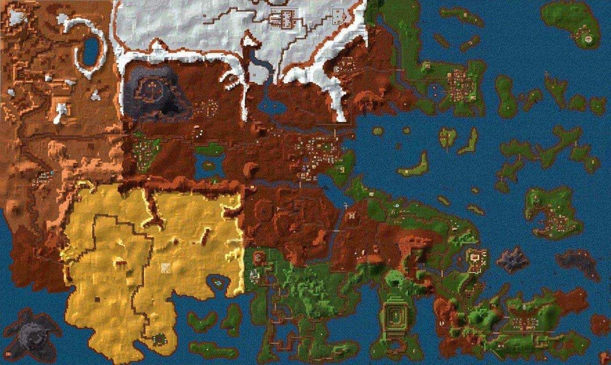

.. _地图大全:

地图大全
==============================================================================

:ref:`全地图和地下城传送作弊码可在此查询 <J键用途>`

.. articles::

.. _恩洛斯地图和地下城难度:

恩洛斯地图和地下城难度
------------------------------------------------------------------------------
我们将难度分为如下6个等级:

- 非常容易
- 容易
- 中等
- 难
- 非常难
- 极难

各个地图和地下城的难度说明:

- :ref:`新索匹格` 镇 (容易 2.8K exp):
    - :ref:`大耳怪前哨` (非常容易 2.5K exp)
    - :ref:`废庙` (非常容易 5K exp)
    - :ref:`加里克冶炼厂` (非常难 33K exp)
- :ref:`铁拳城堡` (非常容易 4.7K exp):
    - :ref:`斯那格的岩洞` (中等 16K exp)
    - :ref:`羊鸣庙` (中等 8.7K exp)
    - :ref:`龙骑兵岩洞` (中等 12K exp)
    - :ref:`阴影教隐蔽所` (容易 3.5K exp)
    - :ref:`考勒根的豪宅` (中等 16K exp)
- :ref:`浓雾岛` (非常容易 2.2K exp):
    - :ref:`银舵前哨` (中等 6K exp)
- :ref:`布特雷格湾` (非常容易 6K exp):
    - :ref:`烈火爵士大厅` (中等 23K exp)
    - :ref:`神拳庙` (非常容易 2K exp)
    - :ref:`太阳庙` (容易 3K exp)
    - :ref:`海神庙` (非常容易 7.5K exp)
- :ref:`自由天堂` (容易 11K exp):
    - :ref:`龙骑兵堡垒` (中等 19K exp)
    - :ref:`月亮庙` (容易 13K exp)
    - :ref:`疯子埃斯里克的坟墓` (中等 10K exp)
    - :ref:`自由天堂下水道` (容易 6K exp)
    - :ref:`恩洛斯神使` (没有怪物)
    - :ref:`控制中心` (极难 140K exp)
- :ref:`幽灵沼泽` (容易 23K exp):
    - :ref:`龙穴` (中等)
    - :ref:`斯那格铁矿` (中等 15K exp)
    - :ref:`黑摩尔城堡` (非常难 115K exp)
- :ref:`冰冻高原` (中等 39K exp):
    - :ref:`冰风堡垒` (中等 17K exp)
    - :ref:`阴影教` (中等 3K exp)
- :ref:`银湾镇` (中等 20K exp):
    - :ref:`银舵堡垒` (中等 28K exp)
    - :ref:`独立碑` (中等)
    - :ref:`军阀堡垒` (难 33K exp)
- :ref:`布莱克郡` (难 50K exp):
    - :ref:`狼穴` (难 60K exp)
    - :ref:`巨蛇庙` (难 21K exp)
- :ref:`克里格斯` (难 52K exp):
    - :ref:`阿加的实验室` (难 24K exp)
    - :ref:`恶魔据点` (中等 7K exp)
    - :ref:`顶级羊鸣庙` (难 43K exp)
    - :ref:`克里格斯城堡` (非常难 40K exp)
    - :ref:`驯龙者洞穴` (非常难 100K exp)
- :ref:`魔鬼水域` (中等 37K exp):
    - :ref:`阿拉莫斯城堡` (非常难 140K exp)
- :ref:`飞龙沙漠` (极难 300K exp):
    - :ref:`维兰坟墓` (非常难 25x`0K exp)
    - :ref:`NewWorldComputing` (非常容易)
- :ref:`隐士岛` (极难 300K exp):
    - :ref:`超级羊鸣庙` (难 32K exp)
- :ref:`天堂谷` (极难 170K exp)
- :ref:`甜水镇` (非常难 30K exp):
    - :ref:`蜂房` (极难)

推荐练级顺序:

前期:

- :ref:`新索匹格` 镇 (容易 2.8K exp):
    - :ref:`大耳怪前哨` (非常容易 2.5K exp)
    - :ref:`废庙` (非常容易 5K exp)
- :ref:`铁拳城堡` (非常容易 4.7K exp):
    - :ref:`羊鸣庙` (中等 8.7K exp)
    - :ref:`阴影教隐蔽所` (容易 3.5K exp)
- :ref:`浓雾岛` (非常容易 2.2K exp):
    - :ref:`银舵前哨` (中等 6K exp)
- :ref:`布特雷格湾` (非常容易 6K exp):
    - :ref:`神拳庙` (非常容易 2K exp)
    - :ref:`太阳庙` (容易 3K exp)
    - :ref:`海神庙` (非常容易 7.5K exp)
- :ref:`自由天堂` (容易 11K exp):
    - :ref:`月亮庙` (容易 13K exp)
    - :ref:`自由天堂下水道` (容易 6K exp)
- :ref:`幽灵沼泽` (容易 23K exp):

中期:

随便打打.

后期:

- :ref:`幽灵沼泽` (室外不打):
    - :ref:`黑摩尔城堡` (非常难 115K exp)
- :ref:`克里格斯` (难 52K exp):
    - :ref:`克里格斯城堡` (非常难 40K exp)
    - :ref:`驯龙者洞穴` (非常难 100K exp)
- :ref:`魔鬼水域` (中等 37K exp):
    - :ref:`阿拉莫斯城堡` (非常难 140K exp)
- :ref:`飞龙沙漠` (极难 300K exp):
    - :ref:`维兰坟墓` (非常难 25x`0K exp)
- :ref:`隐士岛` (极难 300K exp):
- :ref:`天堂谷` (极难 170K exp)

.. _地图更新时间:

地图更新时间
------------------------------------------------------------------------------
各个地图上的Npc和怪物死光了之后需要等上一定时间才能够刷新，这个时间对于不同的地图分别是:

1. :ref:`新索匹格` 镇：6个月
2. :ref:`铁拳城堡` ：24个月
3. :ref:`浓雾岛` ：24个月
4. :ref:`布特雷格湾` ：8个月
5. :ref:`自由天堂` ：24个月
6. :ref:`幽灵沼泽` ：6个月
7. :ref:`冰冻高原` ：24个月
8. :ref:`银湾镇` ：24个月
9. :ref:`布莱克郡` ：24个月
10. :ref:`克里格斯` ：8个月
11. :ref:`魔鬼水域` ：8个月
12. :ref:`飞龙沙漠` ：6个月
13. :ref:`隐士岛` ：6个月
14. :ref:`天堂谷` ：6个月
15. :ref:`甜水镇` ：8个月， :ref:`蜂房` 7天
