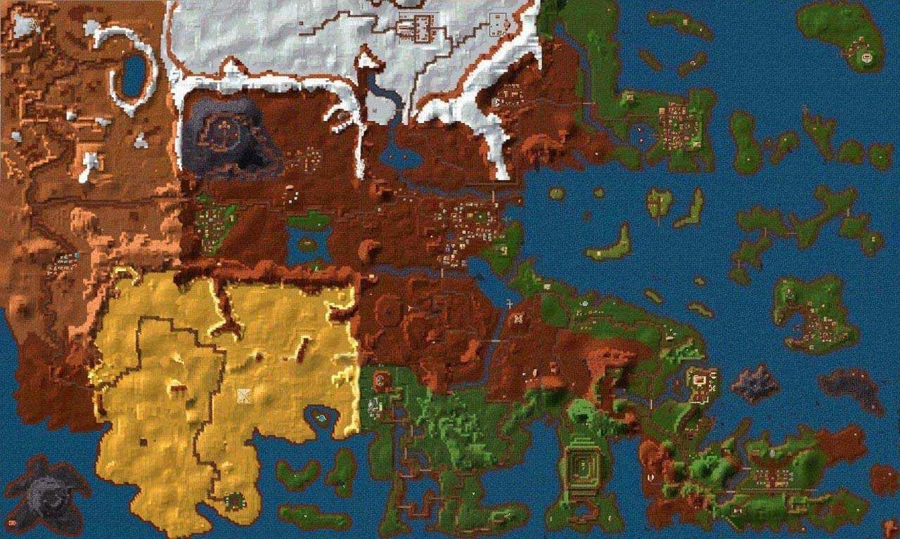

.. _地图大全:

地图大全
==============================================================================

:ref:`全地图和地下城传送作弊码可在此查询 <J键用途>`

目录
------------------------------------------------------------------------------

.. toctree::
   :maxdepth: 1

    新索匹格 (J 40) <01-新索匹格/index.rst>
    铁拳城堡 (J 37) <02-铁拳城堡/index.rst>
    浓雾岛 (J 39) <03-浓雾岛/index.rst>
    布特雷格湾 (J 36) <04-布特雷格湾/index.rst>
    自由天堂 (J 33) <05-自由天堂/index.rst>
    幽灵沼泽 (J 34) <06-幽灵沼泽/index.rst>
    冰冻高原 (J 32) <07-冰冻高原/index.rst>
    银湾镇 (J 35) <08-银湾镇/index.rst>
    布莱克郡 (J 30) <09-布莱克郡/index.rst>
    克里格斯 (J 29) <10-克里格斯/index.rst>
    魔鬼水域 (J 38) <11-魔鬼水域/index.rst>
    飞龙沙漠 (J 31) <12-飞龙沙漠/index.rst>
    隐士岛 (J 28) <13-隐士岛/index.rst>
    天堂谷 (J 27) <14-天堂谷/index.rst>
    甜水镇 (J 26) <15-甜水镇/index.rst>
    

.. _恩洛斯地图和地下城难度:

恩洛斯地图和地下城难度
------------------------------------------------------------------------------
我们将难度分为如下6个等级:

- 非常容易
- 容易
- 中等
- 难
- 非常难
- 极难

各个地图和地下城的难度说明:

- :ref:`新索匹格` 镇 (容易):
    - :ref:`大耳怪前哨` (非常容易)
    - :ref:`废庙` (非常容易)
    - :ref:`加里克冶炼厂` (非常难)
- :ref:`铁拳城堡` (非常容易):
    - :ref:`斯那格的岩洞` (中等)
    - :ref:`羊鸣庙` (中等)
    - :ref:`龙骑兵岩洞` (中等)
    - :ref:`阴影教隐蔽所` (容易)
    - :ref:`考勒根的豪宅` (中等)
- :ref:`浓雾岛` (非常容易):
    - :ref:`银舵前哨` (中等)
- :ref:`布特雷格湾` (非常容易):
    - :ref:`烈火爵士大厅` (容易)
    - :ref:`神拳庙` (非常容易)
    - :ref:`太阳庙` (容易)
    - :ref:`海神庙` (非常容易)
- :ref:`自由天堂` (容易):
    - :ref:`龙骑兵堡垒` (中等)
    - :ref:`月亮庙` (容易)
    - :ref:`疯子埃斯里克的坟墓` (中等)
    - :ref:`自由天堂下水道` (容易)
    - :ref:`恩洛斯神使` (没有怪物)
    - :ref:`控制中心` (极难)
- :ref:`幽灵沼泽` (容易):
    - :ref:`龙穴` (中等)
    - :ref:`斯那格铁矿` (中等)
    - :ref:`黑摩尔城堡` (非常难)
- :ref:`冰冻高原` (中等):
    - :ref:`冰风堡垒` (中等)
    - :ref:`阴影教` (中等)
- :ref:`银湾镇` (中等):
    - :ref:`银舵堡垒` (中等)
    - :ref:`独立碑` (中等)
    - :ref:`军阀堡垒` (难)
- :ref:`布莱克郡` (难):
    - :ref:`狼穴` (难)
    - :ref:`巨蛇庙` (难)
- :ref:`克里格斯` (难):
    - :ref:`阿加的实验室` (难)
    - :ref:`恶魔据点` (中等)
    - :ref:`顶级羊鸣庙` (难)
    - :ref:`克里格斯城堡` (非常难)
    - :ref:`驯龙者洞穴` (非常难)
- :ref:`魔鬼水域` (中等):
    - :ref:`阿拉莫斯城堡` (非常难)
- :ref:`飞龙沙漠` (极难):
    - :ref:`维兰坟墓` (非常难)
    - :ref:`NewWorldComputing` (非常容易)
- :ref:`隐士岛` (极难):
    - :ref:`超级羊鸣庙` (难)
- :ref:`天堂谷` (极难)
- :ref:`甜水镇` (非常难):
    - :ref:`蜂房` (极难)

.. _地图更新时间:

地图更新时间
------------------------------------------------------------------------------
各个地图上的Npc和怪物死光了之后需要等上一定时间才能够刷新，这个时间对于不同的地图分别是:

1. :ref:`新索匹格` 镇：6个月
2. :ref:`铁拳城堡` ：24个月
3. :ref:`浓雾岛` ：24个月
4. :ref:`布特雷格湾` ：8个月
5. :ref:`自由天堂` ：24个月
6. :ref:`幽灵沼泽` ：6个月
7. :ref:`冰冻高原` ：24个月
8. :ref:`银湾镇` ：24个月
9. :ref:`布莱克郡` ：24个月
10. :ref:`克里格斯` ：8个月
11. :ref:`魔鬼水域` ：8个月
12. :ref:`飞龙沙漠` ：6个月
13. :ref:`隐士岛` ：6个月
14. :ref:`天堂谷` ：6个月
15. :ref:`甜水镇` ：8个月， :ref:`蜂房` 7天