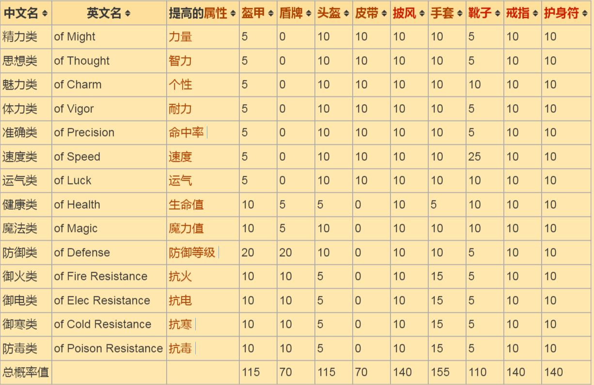
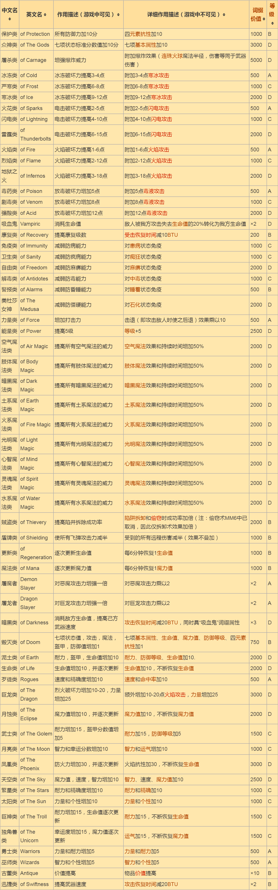
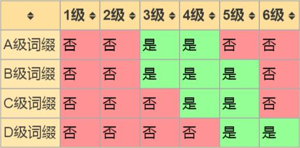
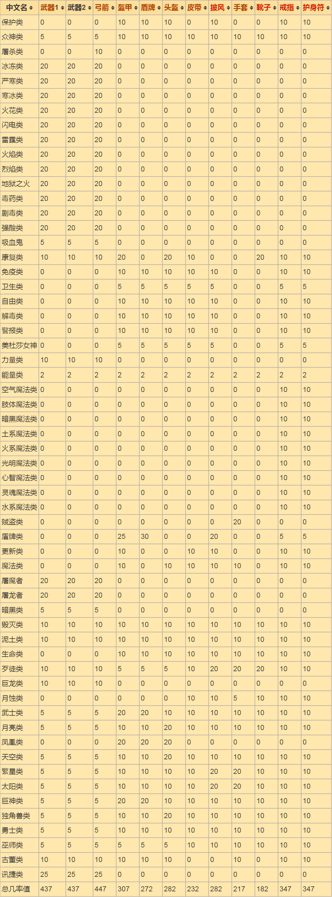
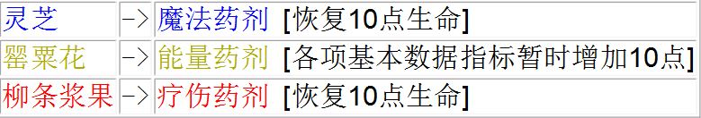
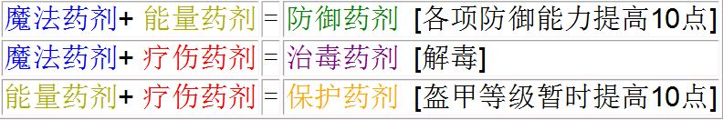
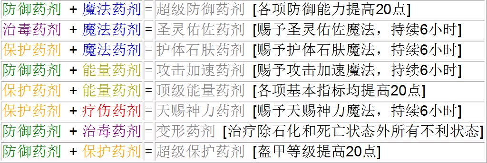
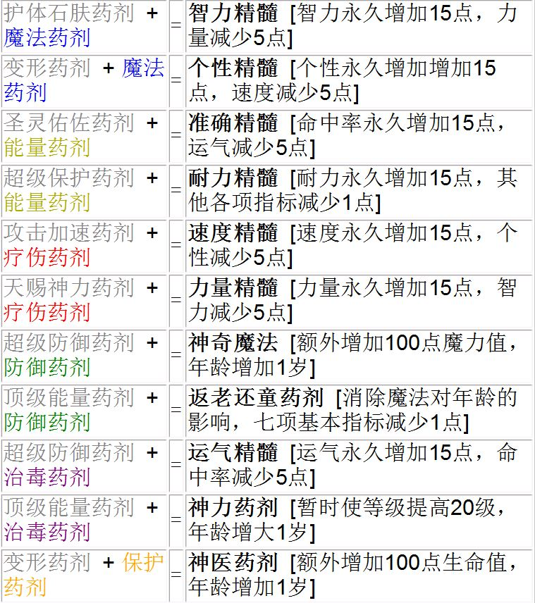

.. _物品装备系统:

物品装备 (词缀系统, 药水配方)
==============================================================================

:ref:`全装备作弊码可在此查询 <F键用途>`

.. _词缀系统:

词缀系统
------------------------------------------------------------------------------
请阅读 :ref:`标准词缀` 和 :ref:`特殊词缀` 两节.

一些附加说明:

- 只有出现在武器上时对该武器有效的特殊词缀有:
    - 元素伤害类 (+xx元素伤害)
    - 力量类 (加击退伤害)
    - 屠魔类 (对恶魔伤害加倍)
    - 屠龙类 (对龙类伤害加倍)
    - 迅捷类 (-20BTU)
    - 吸血类 (1/5的伤害转化为治疗自己, 弓箭无效)
    - 暗黑类 (迅捷加吸血)
- 屠杀类 只能出现在弓箭上.
- 如果用修改器对物品加了普通词缀和特殊词缀, 则特殊词缀不予显示, 但是有效果.
- 对于神器类物品, 所有标准词缀无效, 大部分特殊词缀无效.
    - 有效的词缀有:
        - 能量类 (+等级)
        - 元素伤害类 (+xx元素伤害)
        - 迅捷类 (-20BTU)
        - 吸血类 (1/5的伤害转化为治疗自己, 弓箭无效)
        - 暗黑类 (迅捷加吸血)
        - 屠魔类 (对恶魔伤害加倍)
        - 屠龙类 (对龙类伤害加倍)
    - 无效的词缀有:
        - 众神类 (+所有属性)
        - 保护类 (+所有抗性)

.. _标准词缀:

标准词缀
~~~~~~~~~~~~~~~~~~~~~~~~~~~~~~~~~~~~~~~~~~~~~~~~~~~~~~~~~~~~~~~~~~~~~~~~~~~~~~

标准词缀是物品的词缀的一类，指仅提高单一属性（包括7项基本属性、5项抗性与生命值、魔力值、防御等级）的词缀。与其相对的，具有其他特殊效果的词缀为特殊词缀。

注意：武器只能带特殊词缀，不可能带标准词缀，除非玩家使用修改器。

**概率值**

**词缀价值**

标准词缀的词缀价值=100×提高的属性值。

物品实际价值=物品原有价值+词缀价值。

例如：一个皮带提高15点力量，其词缀价值就是1500，物品实际价值就是原有价值加上1500。

**提高属性值**

各等级物品的标准词缀可提高属性值的范围表：

- <物品等级>: <提高值>
- 1: 0
- 2: 1-5
- 3: 3-8
- 4: 6-12
- 5: 10-17
- 6: 15-25

.. _特殊词缀:

特殊词缀
~~~~~~~~~~~~~~~~~~~~~~~~~~~~~~~~~~~~~~~~~~~~~~~~~~~~~~~~~~~~~~~~~~~~~~~~~~~~~~

例如：带标准词缀“精力类”的4级物品，对力量的提高值不会低于6，也不会超过12点。
特殊词缀是物品的词缀的一类，指具有特殊效果的词缀。特殊词缀与标准词缀相对，标准词缀只提高单一属性，特殊词缀具有更多特殊效果。

特殊词缀具有等级，详见下文。

**词缀描述、价值与等级**

词缀描述、价值与等级列表：

物品总价值=物品原有价值+词缀价值（词缀价值标注×n的，物品总价值=物品原有价值×n）

**特殊词缀等级**

特殊词缀等级是特殊词缀特有的一项标准（标准词缀不分等级），其影响某等级的物品出现某等级的特殊词缀的可能。比如低级（A级）的特殊词缀只能出现在中级（3-4级）的物品中。详细的列表见下。

下面的表格显示了某等级的物品是否可以出现某等级的特殊词缀：

**概率值表**

特殊词缀出现的概率值表：

表中5、10、20等数字表示对应物品出现对应词缀的几率值。

.. _药水配方:

药水配方
------------------------------------------------------------------------------

**基础药剂**

**初级药剂**

**中级药剂 (白色药剂)**

**高级药剂 (黑色药剂)**

注: 以下各黑色药剂各角色只能喝一次。

.. _神装:

神装
------------------------------------------------------------------------------
- 武器: 莫德雷德 (屠龙类), 由于近战武器有30BTU下限, 匕首默认60BTU, 攻击加速-25BTU, 随便速度属性不低就能-5BTU到达下限, 所以 ``迅捷类`` 词缀对匕首无用, 而屠龙类能大大加强对龙的伤害.
- 弓箭: 帕西佛 (地狱之火), 由于自带 ``迅捷类`` 和 ``屠杀类`` 词缀, 所以加火焰伤害才是实惠的选择.
- 饰品:
    - 莫根, 伊格兰尼, 珍妮弗 (能量类), +50%所有魔法等级, 饰品上有用的词缀也就能量类了.
- 靴子: 赫尔姆斯 (能量类), +100速度是冲击400速度上限的必要条件, 0BTU弓箭的必要条件.
- 头盔: 奥丁 (能量类), +50抗性非常不错, -40速度也问题不大, 一样能达到400速度上限.
- 披风: 潘德拉根 (能量类), +拆卸术 不错, 免疫中毒.
- 其他部件: 用 速度类+25 和 众神类+10全属性, 可以凑到400速度.