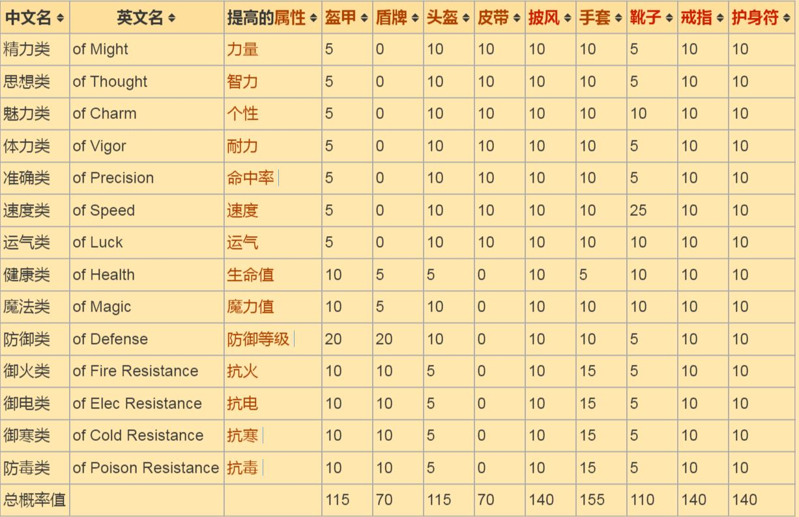
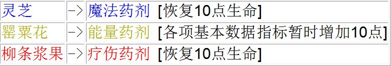
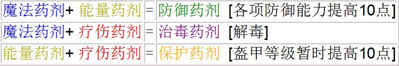
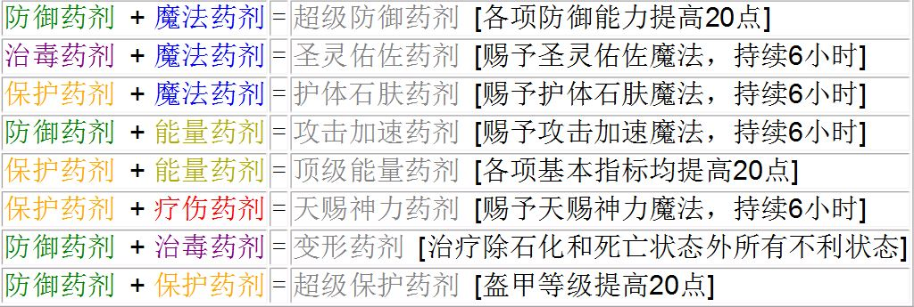

.. _物品装备系统:

物品装备 (词缀系统, 药水配方)
==============================================================================

:ref:`全装备作弊码可在此查询 <F键用途>`

.. _词缀系统:

词缀系统
------------------------------------------------------------------------------

.. _标准词缀:

标准词缀
~~~~~~~~~~~~~~~~~~~~~~~~~~~~~~~~~~~~~~~~~~~~~~~~~~~~~~~~~~~~~~~~~~~~~~~~~~~~~~

标准词缀是物品的词缀的一类，指仅提高单一属性（包括7项基本属性、5项抗性与生命值、魔力值、防御等级）的词缀。与其相对的，具有其他特殊效果的词缀为特殊词缀。

注意：武器只能带特殊词缀，不可能带标准词缀，除非玩家使用修改器。

**概率值**

**词缀价值**

标准词缀的词缀价值=100×提高的属性值。

物品实际价值=物品原有价值+词缀价值。

例如：一个皮带提高15点力量，其词缀价值就是1500，物品实际价值就是原有价值加上1500。

**提高属性值**

各等级物品的标准词缀可提高属性值的范围表：

- <物品等级>: <提高值>
- 1: 0
- 2: 1-5
- 3: 3-8
- 4: 6-12
- 5: 10-17
- 6: 15-25

.. _特殊词缀:

特殊词缀
~~~~~~~~~~~~~~~~~~~~~~~~~~~~~~~~~~~~~~~~~~~~~~~~~~~~~~~~~~~~~~~~~~~~~~~~~~~~~~

例如：带标准词缀“精力类”的4级物品，对力量的提高值不会低于6，也不会超过12点。
特殊词缀是物品的词缀的一类，指具有特殊效果的词缀。特殊词缀与标准词缀相对，标准词缀只提高单一属性，特殊词缀具有更多特殊效果。

特殊词缀具有等级，详见下文。

**词缀描述、价值与等级**

词缀描述、价值与等级列表：

.. image:: 特殊词缀.png

物品总价值=物品原有价值+词缀价值（词缀价值标注×n的，物品总价值=物品原有价值×n）

**特殊词缀等级**

特殊词缀等级是特殊词缀特有的一项标准（标准词缀不分等级），其影响某等级的物品出现某等级的特殊词缀的可能。比如低级（A级）的特殊词缀只能出现在中级（3-4级）的物品中。详细的列表见下。

下面的表格显示了某等级的物品是否可以出现某等级的特殊词缀：

.. image:: 特殊词缀等级.jpg

**概率值表**

特殊词缀出现的概率值表：

.. image:: 特殊词缀概率.png

表中5、10、20等数字表示对应物品出现对应词缀的几率值。

.. _药水配方:

药水配方
------------------------------------------------------------------------------

**基础药剂**

**初级药剂**

**中级药剂 (白色药剂)**

**高级药剂 (黑色药剂)**

注: 以下各黑色药剂各角色只能喝一次。

.. image:: 高级药剂.jpg
    :width: 759px
