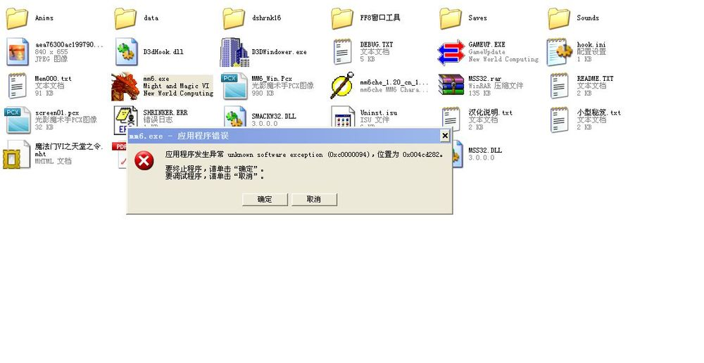
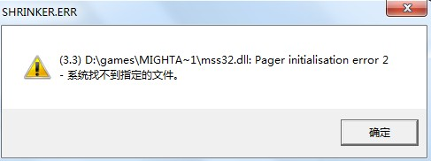

游戏安装
===============================================================================
魔法门6中文版是由台湾育碧公司翻译的。市面上比较流行的是光盘版和硬盘版。而 **硬盘版没有背景音乐和房间内的动画**。所以游戏体验比较好的是光盘版。

**游戏下载**

首先到 `此页面 <github.com/MacHu-GWU/mm6doc-project>`_ 上的链接处下载游戏本体，工具和攻略。

然后打开 ``Game Client`` 目录:

.. code-block:: console

    Might and Magic VI - The Mandate of Heaven (魔法门6 - 天堂之令)
    |--- Game Client
        |--- 中文光盘版
            |--- Might and Magic VI Chinese Version cd1.iso
            |--- Might and Magic VI Chinese Version cd2.nrg
            |--- MSS32.DLL (用于解决.DLL文件缺失)

**安装光盘版**

用虚拟光驱软件加载cd1, 执行游戏安装, 确保游戏安装路径为 **全英文路径** 并勾选包含了图像动画组件。

在安装完毕后加载cd2即可运行 ``mm6.exe`` 开始游戏了。

常见问题
-------------------------------------------------------------------------------

Windows兼容错误
~~~~~~~~~~~~~~~~~~~~~~~~~~~~~~~~~~~~~~~~~~~~~~~~~~~~~~~~~~~~~~~~~~~~~~~~~~~~~~~
若出现以下错误, 右击 ``mm6.exe``, 在兼容性中选择用 win95 或 win98 运行游戏就可以了。

DLL文件缺失
~~~~~~~~~~~~~~~~~~~~~~~~~~~~~~~~~~~~~~~~~~~~~~~~~~~~~~~~~~~~~~~~~~~~~~~~~~~~~~~
若是出现以下错误, 就请将 ``MSS32.DLL`` 文件拷贝到游戏根目录下即可 (和 ``mm6.exe`` 放在一起)。

没有背景音乐
~~~~~~~~~~~~~~~~~~~~~~~~~~~~~~~~~~~~~~~~~~~~~~~~~~~~~~~~~~~~~~~~~~~~~~~~~~~~~~~
游戏默认是按C, D, E, ... 这样的顺序依次寻找光驱, 然后在第一个光驱中寻找背景音乐文件进行播放的。所以我们需要将虚拟光驱放在所有光驱的第一个。一个比较简单的做法是打开Windows设备管理器 (Device Manager), 禁用 (Disable) 本机光驱即可。

无法窗口化
~~~~~~~~~~~~~~~~~~~~~~~~~~~~~~~~~~~~~~~~~~~~~~~~~~~~~~~~~~~~~~~~~~~~~~~~~~~~~~~
只有在16Bit色的模式下，在游戏中按F4可以窗口化。在Win7中桌面点击右键，点击Screen Resolution(屏幕分辨率)，点击Advanced Setting(高级设置)，点击Monitor(显示器)选项卡, 调整颜色为16Bit(系统默认是32位)。

游戏基本操作
-------------------------------------------------------------------------------
游戏默认的操作按键设定如下所示, 而我们可以使用键盘修改器对其进行修改。

**默认设置**

- 方向键：前、后移动，左转、右转
- SHIFT+前后键：跑步移动
- CTRL+左右键：侧移
- PageDown：向上看
- End：向前看
- Delete：向下看
- PageUp：起飞，须掌握空气魔法中的飞行奇术
- Home：直接降落
- Insert：下降
- Enter：切换回合制/即时制
- 空格：拾起地上的物品或打开箱子
- A：使用当前队员的武器攻击，如敌人距离远，则使用弓箭
- S：使用当前队员的备用魔法攻击
- X：跳
- R：休息
- Z：打开团队基本属性窗口
- C：打开当前队员的魔法书
- B：使下一个队员成为可操作状态
- 1、2、3、4：分别打开所对应的4个队员的行囊
- 5、6：与雇佣的NPC谈话
- M：打开地图
- Q：打开当前任务
- N：打开自动摘要
- T：打开日历
- Y：当前队员呐喊

