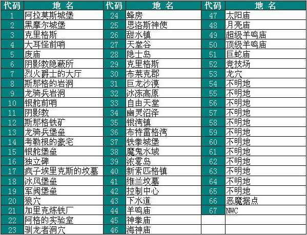
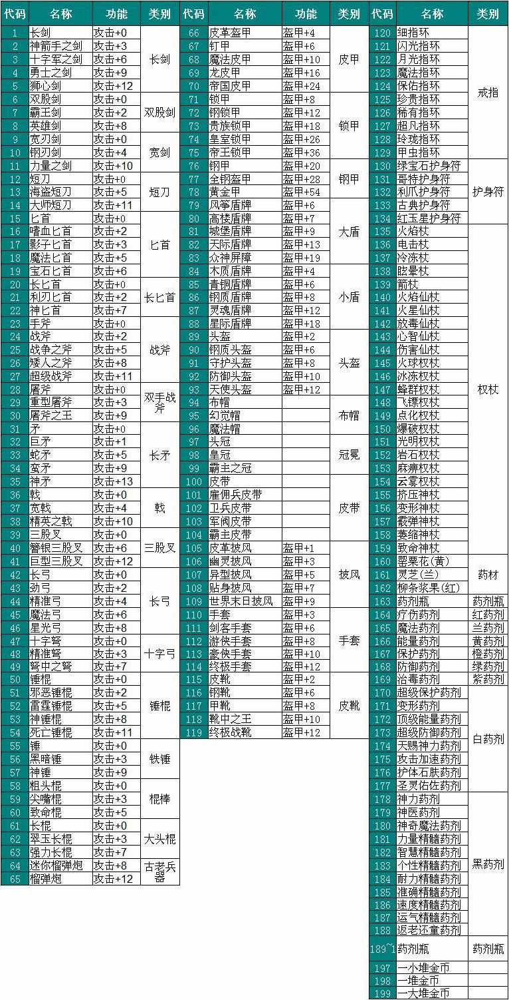
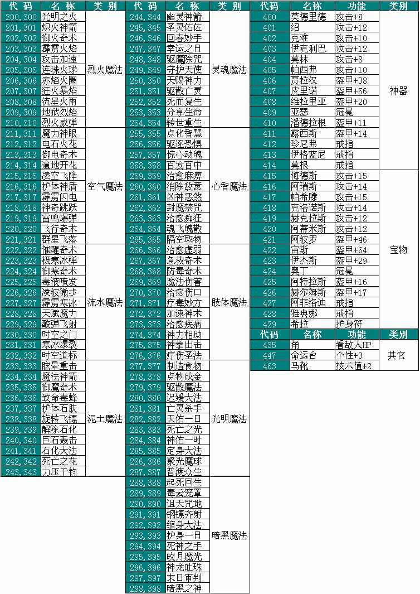

游戏作弊码
==========
J, W, F, E, F2, F6在魔法门中可谓是人尽皆知的秘籍。以下详细解说了这些秘籍的功能。

.. _J键用途:

J键用途 (地图和地下城传送)
-------------------------------------------------------------------------------
在游戏中按下J键, 再输入以下数字然后按Enter键, 能直接传送至各个地图和地下城场景。

城镇地图
~~~~~~~~~~~~~~~~~~~~~~~~~~~~~~~~~~~~~~~~~~~~~~~~~~~~~~~~~~~~~~~~~~~~~~~~~~~~~~~
- 40 :ref:`新索匹格`
- 37 :ref:`铁拳城堡`
- 35 :ref:`银湾镇`
- 39 :ref:`浓雾岛`
- 33 :ref:`自由天堂`
- 30 :ref:`布莱克郡`
- 32 :ref:`冰冻高原`
- 
- 36 :ref:`布特雷格湾`
- 26 :ref:`甜水镇`
- 27 :ref:`天堂谷`
- 28 :ref:`隐士岛`
- 29 :ref:`克里格斯`
- 31 :ref:`飞龙沙漠`
- 34 :ref:`幽灵沼泽`
- 38 :ref:`魔鬼水域`

地下城地图
~~~~~~~~~~~~~~~~~~~~~~~~~~~~~~~~~~~~~~~~~~~~~~~~~~~~~~~~~~~~~~~~~~~~~~~~~~~~~~~
- 1 :ref:`阿拉莫斯城堡`
- 2 :ref:`黑摩尔城堡`
- 3 :ref:`克里格斯城堡`
- 4 :ref:`大耳怪前哨`
- 5 :ref:`废庙`
- 6 :ref:`阴影教隐蔽所`
- 7 :ref:`烈火爵士大厅`
- 8 :ref:`斯那格的岩洞`
- 9 :ref:`龙骑兵岩洞`
- 10 :ref:`银舵前哨`
- 11 :ref:`阴影教`
- 12 :ref:`斯那格铁矿`
- 13 :ref:`龙骑兵堡垒`
- 14 :ref:`考勒根的豪宅`
- 15 :ref:`银舵堡垒`
- 16 :ref:`独立碑`
- 17 :ref:`疯子埃斯里克的坟墓`
- 18 :ref:`冰风堡垒`
- 19 :ref:`军阀堡垒`
- 20 :ref:`狼穴`
- 21 :ref:`加里克冶炼厂`
- 22 :ref:`阿加的实验室`
- 23 :ref:`驯龙者洞穴`
- 24 :ref:`蜂房`
- 25 :ref:`恩洛斯神使`
- 41 :ref:`维兰坟墓`
- 42 :ref:`控制中心`
- 43 :ref:`自由天堂下水道`
- 44 :ref:`羊鸣庙`
- 45 :ref:`神拳庙`
- 46 :ref:`海神庙`
- 47 :ref:`太阳庙`
- 48 :ref:`月亮庙`
- 49 :ref:`超级羊鸣庙`
- 50 :ref:`顶级羊鸣庙`
- 51 :ref:`巨蛇庙`
- 52 :ref:`竞技场`
- 53 :ref:`龙穴`
- 
- 54 不明地
- 55 不明地
- 56 不明地
- 57 不明地
- 58 不明地
- 59 不明地
- 60 不明地
- 61 不明地
- 62 不明地
- 63 不明地
- 64 不明地
- 65 不明地
- 66 :ref:`恶魔据点`
- 
- 67 :ref:`NWC <NewWorldComputing>` (New World Computing 游戏制作组总部彩蛋)

.. _W键用途:

W键用途 (房屋场景)
-------------------------------------------------------------------------------
在游戏中按下W键, 再输入以下数字然后按Enter键, 能直接传送至各个房屋场景。

.. _城镇房屋传送:

城镇房屋
~~~~~~~~~~~~~~~~~~~~~~~~~~~~~~~~~~~~~~~~~~~~~~~~~~~~~~~~~~~~~~~~~~~~~~~~~~~~~~~
兵器, 铠甲, 魔法物品商店, 杂货店。**注: W1, W15, W29分是新索匹格的兵器, 铠甲, 魔法物品商店。卖东西在这几个地方卖最划算**。

- 1～14: 各类兵器屋
- 15～28: 各类铠甲屋
- 29～41: 各类魔法饰物屋
- 42～47: 各类杂货店 (出售装备道具)

旅行驿站码头

- 48～56: 各家驿站
- 57～68: 各家码头

其他

- 69～78: 各家寺庙 (战斗中随时治疗痊愈)。**注: W69是新索匹格的神庙, 最为便宜**。
- 79～88: **各家训练馆**。**注: 各训练馆的升级费率和上限以及传送代码请参考** :ref:`等级训练`。
- 89～112: 各家旅馆

- 113～118: 各家银行
- 119～140: 各家魔法门派
- 141～152: 各地镇公所及行会

- 169: 先知, 每个月拜访神庙加永久属性点之前需拜访先知, 位于 :ref:`铁拳城堡` 地图的山上。
- 170: 恩洛斯神使

行会教派
~~~~~~~~~~~~~~~~~~~~~~~~~~~~~~~~~~~~~~~~~~~~~~~~~~~~~~~~~~~~~~~~~~~~~~~~~~~~~~~
- 268: 加入保护者行会
- 258: 加入走私者行会
- 274: 加入终极利刃
- 278: 加入元素教派
- 287: 加入双面剑锋行会
- 369: 加入自我教派
- 457: 加入海盗行会

魔法行会
~~~~~~~~~~~~~~~~~~~~~~~~~~~~~~~~~~~~~~~~~~~~~~~~~~~~~~~~~~~~~~~~~~~~~~~~~~~~~~~
- 288: 加入烈火教派
- 289: 加入空气教派
- 290: 加入流水教派
- 291: 加入泥土教派
- 292: 加入灵魂教派
- 293: 加入心智教派
- 294: 加入肢体教派
- 367: 加入光明教派
- 255: 加入暗黑教派

.. _武器专家大师传送:

武器专家大师
~~~~~~~~~~~~~~~~~~~~~~~~~~~~~~~~~~~~~~~~~~~~~~~~~~~~~~~~~~~~~~~~~~~~~~~~~~~~~~~
注: **有些武器技能是达到一定条件后找特定NPC习得的, 故不出现在W键列表中**。具体请参考 :ref:`训练与升级` 一章

具体升级方式请参考 :ref:`武器类技能训练 <武器类技能训练>`。

- 438: 弓箭专家
- 241: 弓箭大师
-
- 428: 剑专家
- 250: 剑大师
-
- 322: 匕首专家
- 271: 匕首大师
-
- 461: 矛专家
- 339: 矛大师
-
- 340: 斧专家
-
- 270: 锤专家
- 252: 锤大师
-
- 460: 棍专家

- 478: 古兵器(榴弹枪) 专家

.. _防具专家大师传送:

防具专家大师
~~~~~~~~~~~~~~~~~~~~~~~~~~~~~~~~~~~~~~~~~~~~~~~~~~~~~~~~~~~~~~~~~~~~~~~~~~~~~~~
具体升级方式请参考 :ref:`防具类技能训练 <防具类技能训练>`。

- 434: 盾牌专家
- 248: 盾牌大师
-
- 435: 皮甲专家
- 272: 皮甲大师
-
- 414: 锁甲专家
- 335: 锁甲大师
-
- 298: 钢甲专家
- 299: 钢甲大师

.. _魔法专家大师传送:

魔法专家大师
~~~~~~~~~~~~~~~~~~~~~~~~~~~~~~~~~~~~~~~~~~~~~~~~~~~~~~~~~~~~~~~~~~~~~~~~~~~~~~~
具体升级方式请参考 :ref:`魔法类技能训练 <魔法类技能训练>`。

- 465: 烈火魔法专家
- 455: 烈火魔法大师
-
- 326: 空气魔法专家
- 458: 空气魔法大师
-
- 477: 流水魔法专家
- 459: 流水魔法大师
-
- 466: 泥土魔法专家
- 396: 泥土魔法大师
-
- 467: 灵魂魔法专家
- 426: 灵魂魔法大师
-
- 468: 心智魔法专家
- 401: 心智魔法大师
-
- 469: 肢体魔法专家
- 402: 肢体魔法大师
-
- 239: 光明魔法专家
- 444: 光明魔法大师
-
- 273: 暗黑魔法专家
- 216: 暗黑魔法大师

.. _辅助技术专家大师传送:

辅助技术专家大师
~~~~~~~~~~~~~~~~~~~~~~~~~~~~~~~~~~~~~~~~~~~~~~~~~~~~~~~~~~~~~~~~~~~~~~~~~~~~~~~
具体升级方式请参考 :ref:`辅助类技能训练 <辅助类技能训练>`。

- 462: 修补术专家
- 277: 修补术大师

- 408: 冥想术专家
- 456: 冥想术大师

- 440: 健身术专家
- 284: 健身术大师

- 429: 鉴定术专家
- 285: 鉴定术大师

- 424: 学习术专家
- 407: 学习术大师

- 430: 拆卸术专家
- 275: 拆卸术大师
 
- 303: 经营术专家
- 397: 经营术大师

- 415: 洞察术专家
- 336: 洞察术大师

- 304: 交际术专家
- 276: 交际术大师

.. _六大议会:

六大议会
~~~~~~~~~~~~~~~~~~~~~~~~~~~~~~~~~~~~~~~~~~~~~~~~~~~~~~~~~~~~~~~~~~~~~~~~~~~~~~~
六大议会 **主线任务** 请参考 :ref:`主线任务`, 六大议会 **职业任务** 请参考 :ref:`职业任务`。

- 154: 铁拳城堡 (:ref:`铁拳城堡`), :ref:`找到盾牌 <找到盾牌>` 任务, :ref:`游侠职业任务`。
- 156: 加冕殿 (:ref:`浓雾岛`), :ref:`找到时间沙漏 <找到时间沙漏>` 任务, :ref:`巫师职业任务`。
- 158: 坦普城堡 (:ref:`自由天堂`), :ref:`恶魔据点 <任务恶魔据点>` 任务, :ref:`剑客职业任务`。
- 160: 斯通城堡 (:ref:`冰冻高原`), :ref:`俘虏盗贼王子 <俘虏盗贼王子>` 任务, :ref:`牧师职业任务`。
- 162: 加冕殿 (:ref:`银湾镇`), :ref:`稳定价格 <稳定价格>` 任务, :ref:`僧侣职业任务`。
- 164: 斯壮姆嘉德城堡 (:ref:`冰冻高原`), :ref:`结束冬天 <结束冬天>` 任务, :ref:`弓箭手职业任务`。

.. _F键用途:

F键用途 (各种物品)
-------------------------------------------------------------------------------
在游戏中按下J键, 再输入以下数字然后按Enter键, 能直接得到游戏中的各种物品。

**下面以文字形式列出了所有物品**

基础物品 (1-400)
~~~~~~~~~~~~~~~~~~~~~~~~~~~~~~~~~~~~~~~~~~~~~~~~~~~~~~~~~~~~~~~~~~~~~~~~~~~~~~~
* 1 - 14 各种剑
* 15 - 22 各种匕首
* 23 - 30 各种斧
* 31 - 41 各种矛
* 42 - 49 各种弓
* 50 - 57 各种锤棍
* 58 - 63 棍棒
* 64与65 为榴弹枪
* 66 - 78 各种护甲
* 79 - 88 各种盾
* 89 - 99 各种头盔
* 100 - 104 各种皮带
* 105 - 109 各种披风
* 110 - 114 各种手套
* 115 - 119 各种靴子
* 120 - 129 各种戒指
* 130 - 134 各种护身符
* 135 - 159 各种权杖
* 160 - 196 各种药材药瓶
* 197 - 199 为钱币
* 200 - 298 各种咒语卷轴
* 300 - 398 各种魔法书籍
* 400 - 429 各种神器

特殊神器 (400-429)
~~~~~~~~~~~~~~~~~~~~~~~~~~~~~~~~~~~~~~~~~~~~~~~~~~~~~~~~~~~~~~~~~~~~~~~~~~~~~~~
* 400 - 莫德里德: 匕首, 2d3+8 (10 ~ 14), 吸血
* 401 - 绍: 锤子, 2d5+12 (14 ~ 22), 击退敌人, +20力量
* 402 - 克难: 3d7+10 (13 ~ 31) 斧子, 对恶魔和龙系伤害翻倍, +20力量
* 403 - 伊克利巴: 单手剑, 30力量
* 404 - 莫林: 双手棍锤, 2d4+8 (10 ~ 16), 减少BTU, +40法力
* 405 - 帕西佛: 弓箭, 5d2+10 (15 ~ 20), 减少BTU, 爆炸攻击
* 406 - 贾拉汉: 锁甲, 38 Armor, +10所有抗性, +25生命
* 407 - 皮里诺: 钢甲, 56 Armor, +30耐力, 减少受打击恢复时间, 缓慢回血
* 408 - 维拉里亚: 盾牌, 20 Armor, 飞弹伤害减半, 命中+30
* 409 - 亚瑟: 冠冕, 7项属性+10, +25法力
* 410 - 潘德拉根: 披风, 11 Armor, +30运气, 提高拆卸术, 免疫毒
* 411 - 露稀斯: 靴子, 14 Armor, +30速度
* 412 - 珍妮弗: 戒指, +30法力, 光明黑暗魔法等级+50%
* 413 - 伊格兰尼: 戒指, +25法力, 自我系魔法等级+50%
* 414 - 莫根: +20法力, 元素系魔法等级+50%
* 415 - 海德斯: 剑, 3d3+15 (18 ~ 24), +20点毒伤害, 提高拆卸术, 自己缓慢掉血
* 416 - 阿瑞斯: 锤棍, 2d4+14 (16 ~ 22), +30点火伤害，+25火抗
* 417 - 帕希滕: 长矛, 2d6+15/3d6+15双手 (17 ~ 27/18 ~ 31双手), 力量, 耐力, 命中各+20, 铠甲等级, 速度各-10
* 418 - 克洛诺斯: 战斧, 4d2+14 (18 ~ 22), +100生命, 运气-50
* 419 - 赫克拉斯: 剑, 4d5+12 (16 ~ 32), 力量+50, 耐力+20, 智力-30 
* 420 - 阿蒂米斯: 长弓, 5d2+12 (17 ~ 22), 附带20点电伤害, 所有抗性-10
* 421 - 阿波罗: 锁甲, 46 Armor, +20所有抗性, +20运气, -30耐力
* 422 - 宙斯: 钢甲, 64 Armor, +50生命, 法力, 运气, -50智力
* 423 - 伊杰斯: 盾牌, 29 Armor, 免疫石化, 飞弹伤害减半, +20运气, -20速度
* 424 - 奥丁: 冠冕, +50所有抗性, -40速度
* 425 - 阿特拉斯: 披风, 16 Armor, +100力量, -40速度
* 426 - 赫尔姆斯: 靴子, 17 Armor, +100速度, -40命中
* 427 - 阿菲洛迪特: 戒指, +100个性, -40运气
* 428 - 雅典娜: 戒指, +100智力, -40力量
* 429 - 希拉: +50生命, 法力, 运气, -50智力

任务物品物品 (430 - 580)
~~~~~~~~~~~~~~~~~~~~~~~~~~~~~~~~~~~~~~~~~~~~~~~~~~~~~~~~~~~~~~~~~~~~~~~~~~~~~~~
* 430 - 皮囊
* 431 - 皮囊
* 432 - 皮囊
* 433 - 时间沙漏 (主线任务物品)
* 434 - 圣杯 (牧师升级大主教任务物品)
* 435 - **角 (可以看到怪物的血量)**
* 436 - 珠宝
* 437 - 月亮石
* 438 - 黄宝石
* 439 - 红宝石
* 440 - 紫水晶
* 441 - 绿宝石
* 442 - 紫黄宝石
* 443 - 太阳石
* 444 - 绿宝石
* 445 - 蓝宝石
* 446 - 第三只眼
* 447 - 命运台
* 448 - 十字架
* 449 - 蜡烛台
* 450 - 虎像
* 451 - 熊像
* 452 - 狼像
* 453 - 鹰像
* 454 - 龙像
* 455 - 龙爪 (游侠升级大英雄任务物品)
* 456 - 控制块 (主线任务物品)
* 457 - 德里克斯的水晶 (巫师升级大魔法师任务物品)
* 458 - 褪色珍珠
* 459 - 纯净珍珠
* 460 - 玫瑰花
* 461 - 坦耐尔之铃
* 462 - 坦普的锣
* 463 - **马靴 (可以提高技术值)**
* 464 - 埃斯里克的头骨
* 465 - 骨头
* 467 - 水晶头骨
* 468 - 铲
* 469 - 锁凿
* 470 - 石头
* 471 - 鸟身怪兽的羽毛
* 472 - 金字塔
* 473 - 酒桶
* 474 - 蛇蛋
* 475 - 美妙钟琴
* 476 - 牙齿
* 477 - 四叶草
* 478 - 长笛
* 479 - 竖琴
* 480 - 宝石
* 481 - 蜘蛛女王的心
* 482 - 虎魄
* 483 - 神灯
* 484 - 苹果
* 485 - 羊鸣披风
* 486 - 龙塔钥匙 (弓箭手升级魔箭手任务物品)
* 487 - 加里克实验室钥匙
* 488 - 斯纳格秘室的钥匙
* 489 - 大耳怪前哨的钥匙
* 490 - 钥匙
* 491 - 钥匙
* 492 - 魔法师的钥匙
* 493 - 地图
* 494 - 地图
* 495 - 地图
* 496 - 地图
* 497 - 地图
* 498 - 斯纳格的战斧
* 499 - 卡尔本爵士的盾牌 (主线任务物品)
* 500 - 消息卷宗
* 501 - 消息卷宗
* 502 - 消息卷宗
* 503 - 消息卷宗
* 504 - 消息卷宗
* 505 - 消息卷宗
* 506 - 消息卷宗
* 507 - 消息卷宗
* 508 - 消息卷宗
* 509 - 消息卷宗
* 510 - 消息卷宗
* ……… - 消息卷宗
* ……… - 消息卷宗
* ……… - 消息卷宗
* 547 - 消息卷宗
* 548 - 消息卷宗
* 549 - 消息卷宗
* 550 - 阿尔法记忆水晶 (主线任务四大水晶)
* 551 - 贝塔记忆水晶 (主线任务四大水晶)
* 552 - 德尔塔记忆水晶 (主线任务四大水晶)
* 553 - 伊普斯隆记忆水晶 (主线任务四大水晶)
* 554 - 蝙蝠粪袋
* 555 - 浴室钥匙
* 556 - 贮藏室钥匙
* 557 - 宝藏库钥匙
* 558 - 秘门钥匙
* 559 - 木箱钥匙
* 560 - 教派钥匙
* 561 - 浴室钥匙
* 562 - 贮藏室钥匙
* 563 - 宝藏库钥匙
* 564 - 军阀钥匙
* 565 - 仓库钥匙
* 566 - 房间钥匙
* 567 - 主教钥匙
* 568 - 宝藏库钥匙
* 569 - 远距离传输地钥匙
* 570 - 蜂房圣地钥匙
* 571 - 仓库钥匙
* 572 - 房间钥匙
* 573 - 圣水庙钥匙
* 574 - 火焰之门钥匙
* 575 - 后门钥匙
* 576 - 圣箱钥匙
* 577 - 维兰木箱钥匙
* 578 - 下水道钥匙
* 579 - 火焰护身符
* 580 - 黑暗之神

.. _E键用途:

E键用途 (作弊码)
-------------------------------------------------------------------------------
按下“E”键之后，输入如下单词任一，可得对应效果！

MM6游戏中任何时候，连续输入如下代码（无视输入代码时弹出的窗口，比如rich，按“r”时弹出“休息”窗口，不要紧，继续按“ich”），可得对应效果：

- merlin：所有角色100级，技能点100，掌握全部技能（全部武器、魔法、盔甲；平均20级；一人全大师，一人全专家，两人全普通）
- pesticide：杀死该地区所有敌对生物
- poor：金币变为5000000，经验加5000000
- rich：金币加10000
- scholar：经验加1000
- midas：金币加1000
- seer：当前室外地图全开
- sandman：所有角色状态虚弱，苹果减一
- rip：在“当”的一声之后，所有当前魔法立刻过时效
- hulk：无敌，室内外均可，但自己可以给自己造成伤害

.. _F2键用途:

F2键用途
-------------------------------------------------------------------------------
在游戏中按下F2键可以按照一定顺序在玩家面前一次刷新一只怪物 (最多只能有1个)。如果你按下回车键切换到回合制, 那么怪物刷出来后不会主动攻击。如果玩家贴墙或在墙角刷新出来了远程攻击的龙, 则龙的远程攻击会全部打在墙上, 玩家可以做到无伤击杀龙。

.. _F6键用途:

F6键用途
-------------------------------------------------------------------------------
下雪。