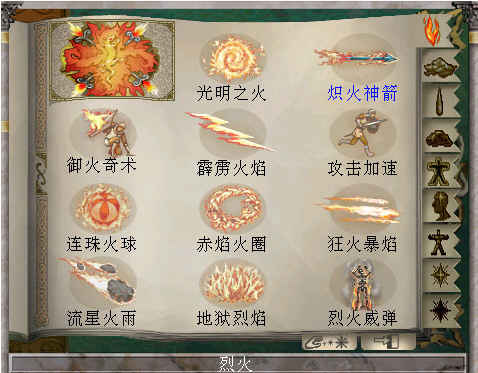
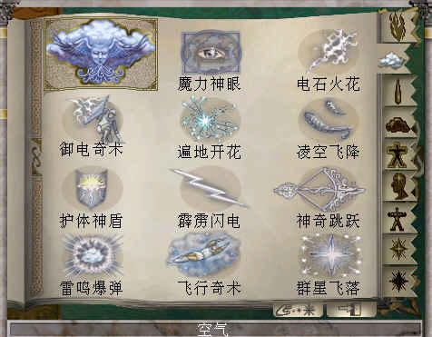
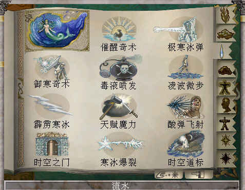
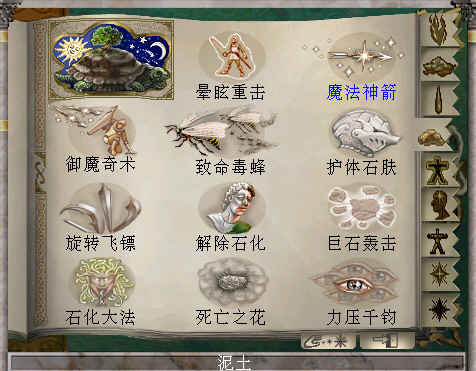
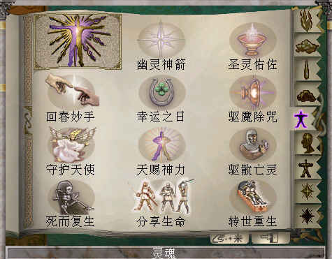
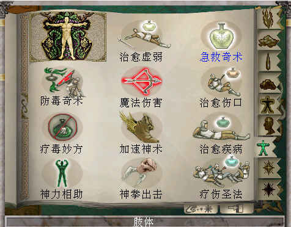
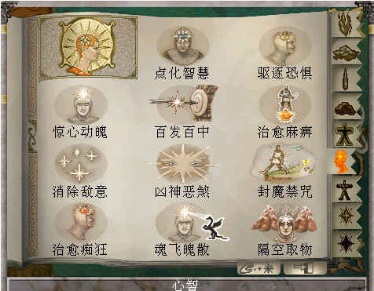
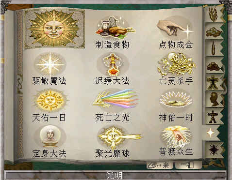
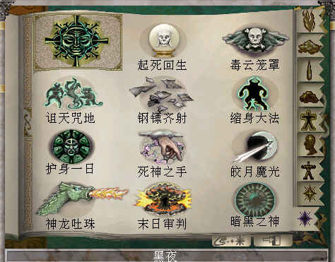

.. _魔法大全:

魔法大全
===============================================================================

.. _烈火魔法技能:

烈火魔法技能
-------------------------------------------------------------------------------

**光明之火（SP 1）**：能扩大你的队伍在黑暗中的可视范围

- 普通：持续时间为1小时乘以施放者的魔法等级
- 专家：使光线更明亮
- 大师：光线最明亮

**炽火神箭（SP 1）**：发射火焰箭。不同于其他魔法，它的准确性极差，和普通弓箭没有大的区别（但是有火系魔法的威力）。它的攻击力为1-8点。

- 普通：发射时消耗2点魔力值
- 专家：发射时消耗1点魔力值
- 大师：发射时不消耗魔法，恢复最快

**御火奇术（SP 3）**：提高角色对火焰攻击的防御力。持续时间为1小时乘以施放者的魔法等级。

- 普通：每个魔法等级增加防御力一点
- 专家：每个魔法等级增加防御力二点
- 大师：每个魔法等级增加防御力三点

**霹雳火焰（SP 4）**：可对单一目标发射火焰轰炸。攻击力为魔法等级乘以1-4点。它发射消耗低，对自身安全，攻击有效性强，是巫师的可靠攻击武器。

- 普通：逐渐恢复
- 专家：恢复较快
- 大师：恢复最快

**攻击加速（SP 5）**：减少角色发射魔法或兵器攻击后的所需恢复时间。在此魔法失效后六小时内角色将处于虚弱状态。

- 普通：持续时间为1小时加上1分钟乘以魔法等级
- 专家：使队伍中所有人受益
- 大师：持续时间为1小时加上3分钟乘以魔法等级

**连珠火球（SP 8）**：这是深受巫师青睐的武器。火球可攻击单个怪兽，但爆炸时会伤害所有爆炸范围内的目标。如果距离太近，你自己也可能受到伤害。其攻击力为魔法等级乘以1-6。

- 普通：逐渐恢复
- 专家：恢复较快
- 大师：恢复最快

**赤焰火圈（SP 10）**：形成一个火焰攻击圈，对周围所有在有效范围内的怪兽进行打击，并且不会危及你的自身。攻击力为6点加上自身魔法等级。

- 普通：角色周围小范围有效
- 专家：较大范围有效
- 大师：恢复最快

**狂火暴焰（SP 15）**：向角色面前的目标发射火焰束。由于只能向正前方攻击，所以需要提高准确性。攻击力为4点加上自身魔法等级的1-3倍。

- 普通：恢复慢，可以发射三束
- 专家：恢复速度一般，可以发射五束
- 大师：恢复较快，可以发射七束

**流星火雨（SP 20）**：召唤天空的陨石降落在所选中的目标周围。施法时不能离目标太近，以免危及自身。攻击力为8点加上自身的魔法等级。只能在室外使用。

- 普通：恢复慢，有八颗陨石
- 专家：恢复速度一般，有十二颗陨石
- 大师：恢复较快，有十六颗陨石

**地狱烈焰（SP 25）**：可以把视野中的所有目标全部付之一炬，并不会危及自身。最适合消灭大批蜂拥而来的怪兽。攻击力为12点加上魔法等级。它只能在室内使用。

- 普通：恢复速度较慢
- 专家：恢复较快
- 大师：恢复最快

**烈火威弹（SP 30）**：它是最具威力的单一目标攻击魔法之一。摧毁力极大，只有最强大的怪兽才有可能侥幸逃生。攻击力为15点加上魔法等级的1－15倍

- 普通：恢复速度较慢
- 专家：恢复较快
- 大师：恢复最快

.. _空气魔法技能:

空气魔法技能
-------------------------------------------------------------------------------

**魔力神眼（SP 1）**：能在屏幕右上角产生自动地图，标明怪兽所处位置和室外的其他值得一去的地点。持续时间为1小时乘以魔法等级。

- 普通：只显示地形和怪兽
- 专家：显示财宝
- 大师：显示“值得一去”的地点

**电石火花（SP 1）**：向单一目标发射静电束。攻击力只有2-6点，但百发百中。

- 普通：发射时消耗2点魔力值
- 专家：发射时消耗1点魔力值，恢复较快
- 大师：发射时不消耗魔法，恢复最快

**御电奇术（SP 3）**：提高角色防御电击的能力。

- 普通：每个魔法等级增加防御力一点
- 专家：每个魔法等级增加防御力二点
- 大师：每个魔法等级增加防御力三点

**遍地开花（SP 4）**：向周围发射光球，方向性不易控制，但适合在室外消灭大批蜂拥而来的低级怪兽。攻击力为2点加上魔法等级。

- 普通：逐渐恢复，有3个光球
- 专家：恢复较快，有5个光球
- 大师：恢复最快，有7个光球

**凌空飞降（SP 5）**：它能当角色从高于十英尺高处跳下时减慢降落速度，避免受伤。此魔法只要一个角色施法，其他角色均可受益。

- 普通：持续时间为5分钟乘以魔法等级
- 专家：持续时间为10分钟乘以魔法等级
- 大师：持续时间为1小时乘以魔法等级

**护体神盾（SP 8）**：它能减慢飞弹的速度，从而使远距离攻击性武器（如弓箭，岩石等）的攻击力减半。

- 普通：持续时间为1小时加上5分钟乘以魔法等级
- 专家：对所有角色有效
- 大师：持续时间为1小时加15分钟乘以魔法等级

**霹雳闪电（SP 10）**：它是深受巫师青睐的武器之一。可以向单一目标发射电光霹雳，且百发百中。攻击力

- 为自身魔法等级的1-8倍。
- 普通：逐渐恢复
- 专家：恢复较快
大师：恢复最快

**神奇跳跃（SP 15）**：它能使角色一跃到达60英尺的高处，而且在掉下时毫发无损。

- 普通：恢复较慢
- 专家：恢复较快
- 大师：恢复最快

**雷鸣爆弹（SP 20）**：这是一项邪恶的魔法，可以改变单一目标周围的空气流动，形成霹雳。它的攻击力为10点加上自身魔法等级的1-10倍。

- 普通：恢复较慢
- 专家：恢复较快
- 大师：恢复最快

**飞行奇术（SP 25）**：使你的角色具备飞行的能力。这个魔法消耗非常大，并只限在室外使用，但能使你受益颇多。

- 普通：持续时间为5分钟乘以魔法等级
- 专家：持续时间为10分钟乘以魔法等级
- 大师：持续时间为1小时乘以魔法等级

**群星飞落（SP 30）**：召唤天空中的群星痛击敌人并把他们付之一炬。攻击力为20点加上自身魔法等级。只能在室外使用，有可能伤及自身。

- 普通：恢复较慢，有8颗星
- 专家：恢复较快，有12颗星
- 大师：恢复最快，有16颗星

.. _流水魔法技能:

流水魔法技能
-------------------------------------------------------------------------------

**催醒奇术（SP 1）**：可以自动把你们从睡梦中唤醒，如果是因为中了魔法而沉睡，只要时间不是太久，也可以觉醒。

- 普通：可以唤醒的最长入睡时间为3分钟乘魔法等级
- 专家：可以唤醒的最长入睡时间为1小时乘魔法等级
- 大师：可以唤醒的最长入睡时间为1天乘魔法等级

**极寒冰弹（SP 1）**：可以向单一目标发射冰冻飞弹。它的攻击力只有2-6点，但百发百中。你的水系魔法越高，发射后的恢复时间越短。水系魔法大师可以不耗点数发射

- 普通：消耗2点魔力值
- 专家：消耗1点魔力值，恢复较快
- 大师：不消耗魔法，恢复最快

**御寒奇术（SP 3）**：提高所有角色的防冻能力。持续时间为1小时乘以施放者的魔法等级。

- 普通：防御力为每个魔法等级一点
- 专家：防御力为每个魔法等级二点
- 大师：防御力为每个魔法等级三点

**毒液喷发（SP 4）**：可对向你正前方的怪兽喷射毒液。尽管攻击力较差，但因为大多数怪兽不具防毒能力，所以非常有效。每次发射的攻击力为2点加上自身魔法等级的1-2倍。

- 普通：恢复较慢，可以发射1束
- 专家：恢复较快，可以发射3束
- 大师：恢复最快，可以发射5束

**凌波微步（SP 5）**：它只能在室外使用。可以使你的角色在水面行走自如。

- 普通：持续时间为5分钟乘以魔法等级
- 专家：持续时间为10分钟乘以魔法等级
- 大师：持续时间为1小时乘以魔法等级

**霹雳寒冰（SP 8）**：可以向单一目标发射寒冰霹雳。攻击力为自身魔法等级的1-7倍。

- 普通：恢复较慢
- 专家：恢复较快
- 大师：恢复最快

**天赋魔力（SP 10）**：使角色点化普通物品使其具有魔力。成功率为10%乘以魔法等级数。只有达到大师级水平才可以点化武器。

- 普通：点化威力较弱
- 专家：点化威力较强
- 大师：可以点化武器

**酸弹飞射（SP 15）**：可以向单一目标发射强酸。它的攻击力为9点加上自身魔法等级的1-9倍，并且百发百中。绝大多数怪兽不具有抗酸能力。

- 普通：恢复较慢
- 专家：恢复较快
- 大师：恢复最快

**时空之门（SP 20）**：该魔法可把队伍远距离传输到上次去过的镇子中央喷泉边。成功率为10%乘以魔法等级。

- 普通：只在室外有效
- 专家：可以在室内使用
- 大师：在任何地点均有效，并可直达目的地

**寒冰爆裂（SP 25）**：可以向正前方的目标发射冰球。当冰球击中目标会散出七块碎片向四周发散，但不会危及角色自身。每片碎片的攻击力为12点加上魔法等级。

- 普通：恢复较慢
- 专家：恢复较快
- 大师：恢复最快

**时空道标（SP 30）**：该项魔法可以使你选定将来的远程传送的地点。地点的远近根据你的魔法等级和点数而定。发射该魔法可以使你回到已选定的任何地点。

- 普通：有1个道标，持续时间为1小时乘魔法等级30
- 专家：有3个道标，持续时间为1天乘魔法等级
- 大师：有5个道标，持续时间为1周乘魔法等级

.. _泥土魔法技能:

泥土魔法技能
-------------------------------------------------------------------------------

**眩晕重击（SP 1）**：可以使你用魔法击打怪兽使其失去知觉，但不能取它性命。你的魔法等级越多，该魔法的威力越大。

- 普通：威力一般
- 专家：威力较大
- 大师：威力最大

**魔法神箭（SP 1）**：可以产生并发射魔法箭。不同于其他魔法，它的准确性极差。当你达到该魔法的大师级水准，就可以不消耗点数而发射魔法。每箭的攻击力为3-8点。

- 普通：发射时消耗2点魔力值
- 专家：发射时消耗1点魔力值，恢复较快
- 大师：不消耗魔法，恢复最快

**御魔奇术（SP 3）**：提高你的角色防御魔法的能力。

- 普通：每个魔法等级增加防御力一点
- 专家：每个魔法等级增加防御力二点
- 大师：每个魔法等级增加防御力三点

**致命毒蜂（SP 4）**：可以使你召唤大批蜇人蜂袭击单一的目标。每群蜂群的攻击力为5点加上自身的魔法等级的1-3倍。该魔法百试不爽，并且无人能抵御该魔法。

- 普通：恢复较慢
- 专家：恢复较快
- 大师：恢复最快

**护体石肤（SP 5）**：提高某个角色的铠甲等级，增加点数为5点加上魔法等级。

- 普通：持续时间为1小时加上5分钟乘以魔法等级
- 专家：对所有角色有效
- 大师：持续时间为1小时加上15分钟乘以魔法等级

**旋转飞镖（SP 8）**：可以向单一目标发射旋转刀刃。每片刀刃的攻击力为自身魔法等级1-5倍。

- 普通：恢复较慢
- 专家：恢复较快
- 大师：恢复最快

**解除石化（SP 10）**：如果及时发射此魔法可以破解石化魔法，恢复原形。魔法的点数越多等级越高，可以破解的受害时间就越长（只要没有超过恢复临界点）。但超过了有效救治时间，又没有普渡众生魔法，要破解魔法只能去神庙救治。

- 普通：可以破解的最长石化时间为3分钟乘以魔法等级
- 专家：可以破解的最长石化时间为1小时乘以魔法等级
- 大师：可以破解的最长石化时间为1天乘以魔法等级

**巨石轰击（SP 15）**：可以向目标发射魔法石，石头只有击中目标才会爆炸，并且可能伤害你自己。爆炸威力为魔法等级的1-8倍。

- 普通：恢复较慢
- 专家：恢复较快
- 大师：恢复最快

**石化大法（SP 20）**：可以使目标暂时变为石头。任何进攻对这些石头像都无能为力。

- 普通：持续时间为5分钟乘以魔法等级
- 专家：持续时间为10分钟乘以魔法等级
- 大师：持续时间为20分钟乘以魔法等级

**死亡之花（SP 25）**：可以向空中发射魔法石，该石头落地后产生的爆炸威力极大，范围极广。攻击力为20点加上自身的魔法等级。它只能在室外使用。

- 普通：恢复较慢
- 专家：恢复较快，有效范围较大
- 大师：恢复最快，有效范围最大

**力压千钧（SP 30）**：可以瞬间使目标的重量急剧增加，从而攻击其内部机能。攻击力为该目标生命值的25%加上魔法等级的2%。攻击对象越庞大，攻击力就越大。

- 普通：恢复较慢
- 专家：恢复较快
- 大师：恢复最快

.. _灵魂魔法技能:

灵魂魔法技能
-------------------------------------------------------------------------------

**幽灵神箭（SP 1）**：可以向单一目标发射具有反射神能量的物质霹雳。该魔法的命中率不高，但灵魂魔法的高超技术可以弥补其不足。它的攻击力为1-6点。

- 普通：恢复较慢
- 专家：恢复较快
- 大师：不消耗魔法

**圣灵佑佐（SP 1）**：可以帮助角色在肉搏站和飞弹袭击中提高命中率。该角色的命中率增加点数为五点加上魔法等级。

- 普通：持续时间为一小时加上五分钟乘以魔法等级
- 专家：对所有的角色有效
- 大师：持续时间为一小时加上十五分钟乘以魔法等级

**回春妙手（SP 3）**：可以使一个角色的生命值恢复3-7点。该项技术越高，恢复时间越快。

- 普通：修补3-7点生命值
- 专家：修补6-9点生命值
- 大师：修补7-11点生命值

**幸运之日（SP 4）**：暂时增加单个角色的幸运点数。

- 普通：幸运值增加十点加每个魔法等级二点
- 专家：幸运值增加十点家每个魔法等级三点
- 大师：对所有角色有效

**驱魔除咒（SP 5）**：如果及时使用该魔法可以破解所受魔法。魔法等级越多，等级越高，可以破解魔法的受害时间越长（没有超过恢复临界点）。但超过了有效救治时间，又没有普渡众生魔法，破解魔法只有去神庙治疗。

- 普通：可以救治的最长受害时间为3分钟乘以魔法等级
- 专家：可以救治的最长受害时间为1小时乘以魔法等级
- 大师：可以救治的最长受害时间为1天乘以魔法等级

**守护天使（SP 8）**：为你的角色寻求神灵的保护，在死亡后把你的队伍带到你上次去的神庙治疗。你要花费死亡时身上携带的一半金币作为医疗费。该魔法持续为一小时乘以魔法等级。

- 普通：每个角色复生各剩一点生命值
- 专家：每个角色复生各剩一半生命值
- 大师：每个角色复生并且生命值加满

**天赐神力（SP 10）**：一旦角色成功击中目标，该魔法可提高其攻击力。增加点数为五点加上灵魂魔法等级。

- 普通：持续时间为一小时加上5分钟乘以魔法等级
- 专家：对所有角色有用
- 大师：持续时间为一小时加上15分钟乘以魔法等级

**驱散亡灵（SP 15）**：使所有视野范围内的亡灵怪兽全部望风而逃。该魔法的有效时间为三分钟加上三分钟乘以魔法等级。

- 普通：恢复较慢
- 专家：恢复较快
- 大师：恢复最快

**死而复生（SP 20）**：如果及时施放该魔法可以有起死回生的作用。灵魂魔法的点数越多，等级越高，可以救治的死亡持续时间就越大（没有达到恢复界点）。但超过有效救治时间，又没有普渡众生魔法，要破解所中魔法只有去神庙治疗。使用该魔法会使你的身体状况降到虚弱

- 普通：可以救治的最长死亡时间为3分钟乘以魔法等级
- 专家：可以救治的最长死亡时间为1小时乘以魔法等级
- 大师：可以救治的最长死亡时间为1天乘以魔法等级

**分享生命（SP 25）**：该魔法可以平均分配你的角色的生命值。所有角色的各项攻击值相加，再加上魔法等级，然后分配给每个角色。但是角色所得到的攻击值不能超过其可以具备的最大值。

- 普通：每个魔法等级增加各个角色1点生命值
- 专家：每个魔法等级增加各个角色2点生命值
- 大师：每个魔法等级增加各个角色3点生命值

**转世重生（SP 30）**：如果你及时发射该魔法可以使你的被杀角色重新生机勃勃。该项技术点数越多，等级越高，可以救治的死亡持续时间就越长（没有超过恢复临界点）。否则只有去神庙治疗。发射该魔法会使你的身体处于虚弱状态

- 普通：可以救治的最长灭绝时间为3分钟乘以魔法等级
- 专家：可以救治的最长灭绝时间为1小时乘以魔法等级
- 大师：可以救治的最长灭绝时间为1天乘以魔法等级

.. _肢体魔法技能:

肢体魔法技能
-------------------------------------------------------------------------------

**治愈虚弱（SP 1）**：如果你及时发射该魔法可以治疗虚弱。魔法等级越多，等级越高，可以治疗的虚弱持续时间就越长（没有超过恢复临界点）。但超过有效救治时间，又没有普渡众生魔法，要治疗虚弱只有去神庙。

- 普通：可以救治的最长虚弱时间为3分钟乘以魔法等级
- 专家：可以救治的最长虚弱时间为1小时乘以魔法等级
- 大师：可以救治的最长虚弱时间为1天乘以魔法等级

**急救奇术（SP 1）**：可以使单个治疗对象的生命值提高。肢体魔法等级越高，恢复时间越短。

- 普通：修补5点生命值
- 专家：修补7点生命值
- 大师：修补10点生命值

**防毒奇术（SP 3）**：可以提高所有角色的抗毒能力。

- 普通：每个魔法等级防御力为1点
- 专家：每个魔法等级防御力为2点
- 大师：每个魔法等级防御力为3点

**魔法伤害（SP 4）**：可以直接用魔法攻击单一目标。攻击力为8点加上自身魔法等级的1-2倍。

- 普通：恢复较慢
- 专家：恢复较快
- 大师：恢复最快

**治愈伤口（SP 5）**：可以恢复施放对象的生命值。所增加点数为5点加上自身魔法等级的两倍。

- 普通：恢复较慢
- 专家：恢复较快
- 大师：恢复最快

**疗毒妙方（SP 8）**：如果及时发射此魔法可以为一个角色驱毒。魔法等级越多，等级越高，可以治疗的中毒时间就越长（没有达到恢复临界点）。但超过有效救治时间又没有普渡众生魔法，要向驱毒，只有去神庙治疗。

- 普通：可以救治的最长中毒时间为3分钟乘以魔法等级
- 专家：可以救治的最长中毒时间为1小时乘以魔法等级
- 大师：可以救治的最长中毒时间为1天乘以魔法等级

**加速神术（SP 10）**：暂时提高一个角色的速度值。

- 普通：速度增加为十点加上每个魔法等级二点
- 专家：速度增加为十点加上每个魔法等级三点
- 大师：魔法对所有角色有效

**治愈疾病（SP 15）**：如果及时发射此魔法可以为一个角色治病。魔法的点数越多，等级越高，可以治疗的患病时间就越长（没有达到恢复临界点）。但超过有效救治时间又没有普渡众生魔法，要治病只有去神庙治疗。

- 普通：可以救治的最长患病时间为三分钟乘以魔法等级
- 专家：可以救治的最长患病时间为一小时乘以魔法等级
- 大师：可以救治的最长患病时间为一天乘以魔法等级

**神力相助（SP 20）**：可以暂时提高单个角色的力量值和耐力值。

- 普通：精力和耐力增加值为十点加上每个魔法等级二点
- 专家：精力和耐力增加值为十点加上每个魔法等级三点
- 大师：对所有角色都有效

**神拳出击（SP 25）**：可以向单一目标发射强力魔法攻击。攻击力为30点加上魔法等级的1-5倍。

- 普通：恢复较慢
- 专家：恢复较快
- 大师：恢复最快

**疗伤圣法（SP 30）**：可以恢复所有角色的生命值。所增加点数为十点加上自身魔法等级的2倍。

- 普通：恢复较慢
- 专家：恢复较快
- 大师：恢复最快

.. _心智魔法技能:

心智魔法技能
-------------------------------------------------------------------------------

**点化智慧（SP 1）**：可以暂时提高一个角色的智力值和性格值。

- 普通：智力和性格的增加值为十点加上每个魔法等级二点
- 专家：智力和性格的增加值为十点加上每个魔法等级三点
- 大师：对所有角色都有效

**驱逐恐惧（SP 1）**：及时发射该魔法可以摆脱恐惧心理。心智魔法的点数越多，等级越高，可以解除的恐惧心理持续时间越长（没有达到恢复临界点）。但超过有效救治时间，又没有普渡众生魔法，要接触恐惧只有去神庙治疗。

- 普通：可以治疗的最长受惊时间为三分钟乘以魔法等级
- 专家：可以治疗的最长受惊时间为一小时乘以魔法等级
- 大师：可以治疗的最长受惊时间为一天乘以魔法等级

**惊心动魄（SP 3）**：可以向单一目标的精神系统发射心理的强力霹雳。它的攻击力为五点加上魔法等级的1-2倍。

- 普通：恢复较慢
- 专家：恢复较快
- 大师：恢复最长

**百发百中（SP 4）**：暂时提高一个角色的准确性。

- 普通：精确度增加值为10点加上每个魔法等级2点
- 专家：精确度增加值为10点加上每个魔法等级3点
- 大师：对所有角色有效

**治愈麻痹（SP 5）**：如果你及时发射该魔法可以治疗麻痹。心智魔法的点数越多，等级越高，可以解除的麻痹持续时间越长（没有达到恢复临界点）。但超过有效救治时间又没有普渡众生魔法，要解除麻痹只有去神庙治疗。

- 普通：可以救治的最长麻痹时间为三分钟乘以魔法等级
- 专家：可以救治的最长麻痹时间为以小时乘以魔法等级
- 大师：可以救治的最长麻痹时间为一天乘以魔法等级

**消除敌意（SP 8）**：可以使单一目标平息怒气，消除对你的敌意。但如果遭到攻击，将立刻重新还击。

- 普通：持续时间为三分钟乘以魔法等级
- 专家：持续时间为六分钟乘以魔法等级
- 大师：持续时间为十二分钟乘以魔法等级

**凶神恶煞（SP 10）**：可以使你视野范围内的怪物全部望风而逃。但如果怪兽遭到攻击，此咒会立刻失效。该魔法对亡灵怪兽无能为力。它的有效时间为三分钟乘以魔法等级。

- 普通：恢复较慢
- 专家：恢复较快
- 大师：恢复最快

**封魔禁咒（SP 15）**：该魔法可以使目标丧失施展魔法的能力。有效时间五分钟乘以魔法等级。

- 普通：恢复较慢
- 专家：恢复较快
- 大师：恢复最快

**治愈痴狂（SP 20）**：如果及时发射该魔法可以治疗疯病。心智魔法等级越高，可以治疗的疯病持续时间就越长（没有超过恢复临界点）。但过了有效时间，又没有普渡众生魔法，要解除疯病只有去神庙治疗。

- 普通：可以救治的最长患病时间为三分钟乘以魔法等级
- 专家：可以救治的最长患病时间为一小时乘以魔法等级
- 大师：可以救治的最长患病时间为一天乘以魔法等级

**魂飞魄散（SP 25）**：与惊心动魄魔法相同，它可以对单个目标进行心智打击，而且它的威力更大。其攻击力为十二点加上魔法等级的1-12倍。

- 普通：恢复较慢
- 专家：恢复较快
- 大师：恢复最快

**隔空取物（SP 30）**：你可以远距离操纵某物体。隔开讨厌的陷阱就能完成一些例如接通开关，拣拾物品，开门等行动。

- 普通：每个魔法等级有一点力量值
- 专家：每个魔法等级有二点力量值
- 大师：每个魔法等级有三点力量值

.. _光明魔法技能:

光明魔法技能
-------------------------------------------------------------------------------

**制造食物（SP 20）**：如果你缺少食物，使用此魔法可以增加食物。

- 普通：提供一天加上每十个魔法等级一天的食物
- 专家：提供一天加上每十个魔法等级二天的食物
- 大师：提供一天加上每十个魔法等级三天的食物

**点物成金（SP 25）**：使你所携带物品中所选定的一项变成金币。其数量为该物品实际价值的40%。每点魔法等级有10%的点化成功率。如果魔法失效，物品将毁坏。

- 普通：使物品变成原值40%的金币
- 专家：使物品变成原值60%的金币
- 大师：使物品变成原值80%的金币

**驱散魔法（SP 30）**：可以解除视野中所有生物所中的魔法禁咒，此项魔法有利夜有弊。恢复所减少的点数等于自身的魔法等级。

- 普通：恢复较慢
- 专家：恢复较快
- 大师：恢复最快

**迟缓大法（SP 35）**：可以使单个怪物的行走速度减半，恢复速度增加一倍。这样怪兽攻击你的概率会降低一半，并且很难赶上你。它的有效时间为一分钟乘以魔法等级

- 普通：恢复较慢
- 专家：恢复较快
- 大师：恢复最快

**亡灵杀手（SP 40）**：可以召唤天堂的神力破解亡灵怪物所具有的邪恶魔力。攻击力为16点加上自身魔法等级的1-16倍。此魔法只对亡灵怪物有效。

- 普通：恢复较慢
- 专家：恢复较快
- 大师：恢复最快

**天佑一日（SP 45）**：只需要付出少许代价就可以施展神力相助、点化智慧、幸运之日、加速神术、百发百中和守护天使魔法。

- 普通：光明魔法的所有魔法威力增加一倍
- 专家：光明魔法的所有魔法威力增加二倍
- 大师：光明魔法的所有魔法威力增加三倍

**死亡之光（SP 50）**：可对视野范围内所有怪物发动攻击。攻击力为25点加上自身魔法等级。该魔法只能在室内使用。

- 普通：恢复较慢
- 专家：恢复较快
- 大师：恢复最快

**神佑一时（SP 55）**：可以同时向你的所有角色提供攻击加速、天赐神力、护体神盾、护体石肤和圣灵佑佐魔法，根据该角色的光明魔法等级高低而定。

- 普通：光明魔法的所有魔法威力增加一倍
- 专家：光明魔法的所有魔法威力增加二倍
- 大师：光明魔法的所有魔法威力增加三倍

**定身大法（SP 60）**：发射该魔法可以麻痹怪兽，使其不能移动或攻击。其有效时间为1分钟乘以魔法等级。在怪物被麻痹过程中你可以全力进攻，而它物还手之力。

- 普通：恢复较慢
- 专家：恢复较快
- 大师：恢复最快

**聚光魔球（SP 65）**：是游戏中威力第二大的魔法。它能集中太阳光束照射于单个目标。因为使用太阳光束，所以必须在室外并在白天施法。它的攻击力为20点加上魔法等级的1-20倍。

- 普通：恢复较慢
- 专家：恢复较快
- 大师：恢复最快

**普渡众生（SP 70）**：每天在日升日落时，你可以召唤天堂神力治愈你的所有角色的各项点数和所有伤病，并恢复魔法。每次使用该魔法会使施法者年龄增加10岁。魔法等级越高，角色的恢复时间越短。

- 普通：每天可以使用1次
- 专家：每天可以使用2次
- 大师：每天可以使用3次

.. _暗黑魔法技能:

暗黑魔法技能
-------------------------------------------------------------------------------

**起死回生（SP 20）**：该魔法可使死亡的生物苟延残喘。但怪物不会对你心存感激，并和你和好。你可以随时随地再置它们于死地。

- 普通：每个魔法等级可以给予怪物10点生命值
- 专家：每个魔法等级可以给予怪物20点生命值
- 大师：每个魔法等级可以给予怪物30点生命值

**毒云笼罩（SP 30）**：使你的角色前方生成一朵毒云，并慢慢在空中飘荡。它的攻击力为25点加上自身魔法等级的1-10倍。只有击中某物体才会消散。

- 普通：恢复较慢
- 专家：恢复较快
- 大师：恢复最快

**诅天咒地（SP 40）**：对视野范围内的所有怪兽发射魔法。

- 普通：持续时间为2分钟乘以魔法等级
- 专家：持续时间为3分钟乘以魔法等级
- 大师：持续时间为4分钟乘以魔法等级

**钢镖齐射（SP 50）**：向正前方的怪兽发射热力锯齿霰弹，可以扫清一切挡路得怪物。每片弹片的攻击力为六点加上自身魔法等级的1-6倍。

- 普通：恢复较慢，有三块弹片
- 专家：恢复较快，有五块弹片
- 大师：恢复最快，有七块弹片

**缩身大法（SP 60）**：可以缩小巨型怪兽的身躯，使其变得容易对付。其持续时间为五分钟乘以魔法等级。被缩小得怪兽它得攻击力也根据身躯得比例相应缩小一半，三分之一或四分之一。

- 普通：使怪兽身躯缩小一半
- 专家：使怪兽身躯缩小三分之一
- 大师：使怪兽身躯缩小四分之一

**护身一日（SP 70）**：同时赐予所有角色防火术，防电术，防冻术和防魔法术。并增加凌空飞降和魔力神眼两项魔法。根据角色的暗黑魔法技术而定。

- 普通：所有魔法威力增加一倍
- 专家：所有魔法威力增加二倍
- 大师：所有魔法威力增加三倍

**死神之手（SP 80）**：可以把单个怪物的灵魂剥离躯体，使它立即毙命。

- 普通：成功率为3%乘以魔法等级
- 专家：成功率为4%乘以魔法等级
- 大师：成功率为5%乘以魔法等级

**皎月魔光（SP 90）**：可以治疗你的所有角色并攻击视野范围内的所有怪兽。尽管它的治愈能力和杀伤作用都不强。但它是唯一可以大面积攻击目标的魔法。只能在室外的黑夜中使用。攻击力为自身魔法等级的1-4倍。治疗力为魔法等级的1-4倍。

- 普通：恢复较慢
- 专家：恢复较快
- 大师：恢复最快

**神龙吐珠（SP 100）**：该魔法可以向单个怪兽喷出云状有毒气体并危及周围的所有生物。它是天下最具威力的攻击魔法。攻击力为自身的魔法等级的1-25倍。

- 普通：恢复较慢
- 专家：恢复较快
- 大师：恢复最快

**末日审判（SP 150）**：该魔法是惨绝人寰的屠城杀手。只有学习暗黑魔法的角色方能在一天中使用一次，并只能在室外使用。它可以攻击地图上出现的所有生物，包括你自己。攻击力为50点加自身魔法等级

- 普通：每天可以使用1次
- 专家：每天可以使用2次
- 大师：每天可以使用3次

**暗黑之神（SP 200）**：该魔法可以包容一切暗黑魔法的威力，故名为暗黑之神。它的威力无法想象，施展时后果不堪设想。只有少数一些生物能侥幸逃命。

- 普通：恢复较慢
- 专家：恢复较快
- 大师：恢复最快