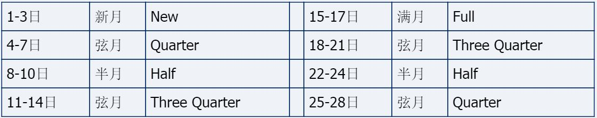
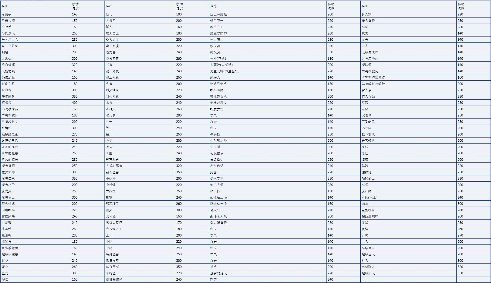
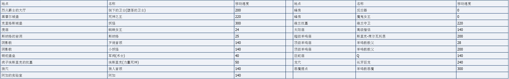
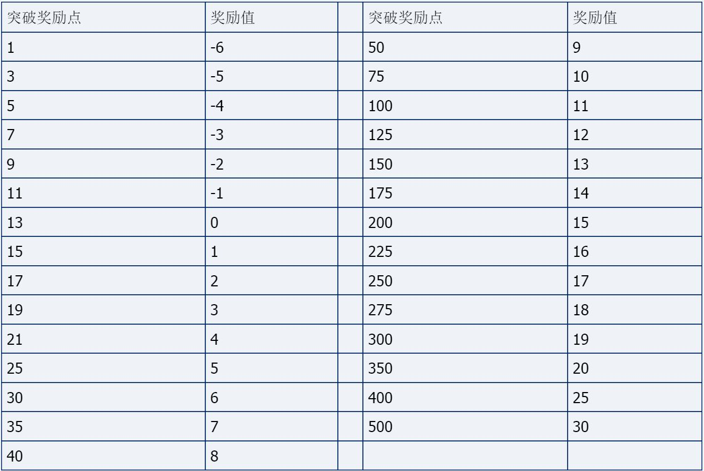
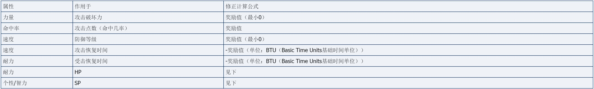
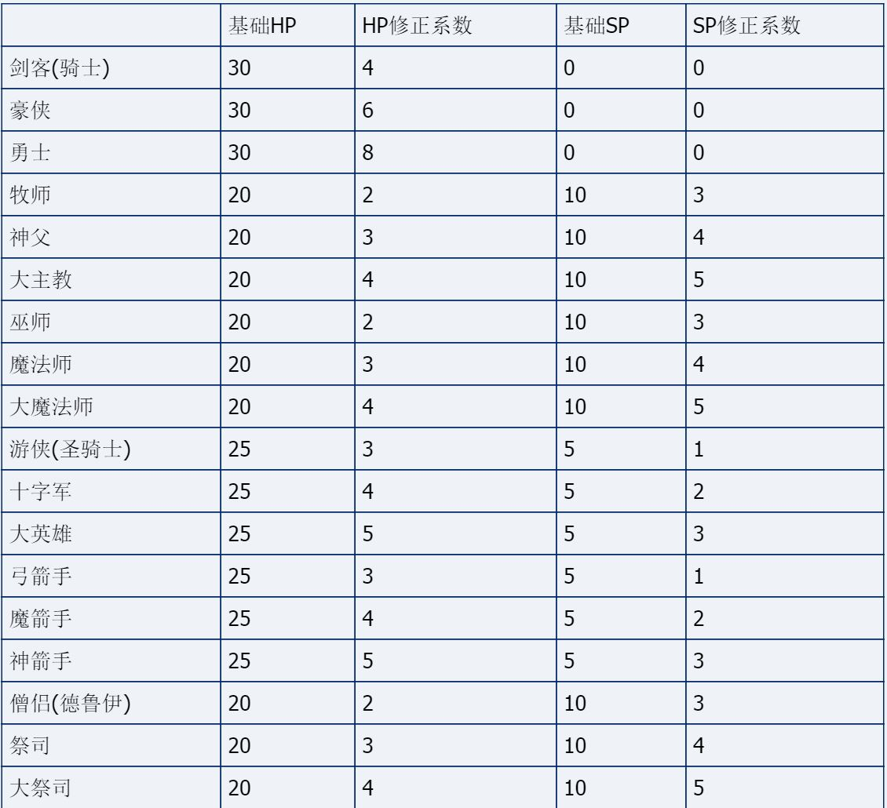

MM6恩报版课本-基础数学
===============================================================================
欢迎来到恩洛斯大陆，你来到了一个与你们的地球相似，但却不完全相同的星球——Colony——上最大的一块大陆——恩洛斯。

在这里，你将会学习到一些新的数学知识。这里的度量单位，数据计算等，都会与你原先所处的地球有所差异。

【在恩版系列课本中，粗方括号（【】）外的东西是作为某恩洛斯向导的角度写的，粗方括号内的东西是作为地球人的角度写的，诸位懂偶的意思吧？- -】

【很多地方参考了匈牙利MM玩家Bones兄的Bones' Combat Guide中的文章和数据，有些数据被我直接拿来使用。比如他测的弓箭射程约1152BLU（他的BLU是我的BLU的1/4，数据要换算。。），不过偶不能确定其精确性，因为经过我的测试，他的数据也有一些是错的，但总之其理念很令人钦佩。另外恩版系列课本中的大型图表，只要未打上Enroth Times logo的，都非吾原创，而是从Bones或其他网友那儿直接翻译了拿来的，特此感谢。本人测试BLU和BTU的工具为MM8LevelEditor 3.74。】

好，现在开始我们的讲解。

一、度量单位
-------------------

1、长度单位
~~~~~~~~~~~~~~~~~~~
当你一脚迈进新索匹格镇大门的时候，你对周边环境、建筑的印象是什么？它们比你原先所处的世界更迷你些么？你走进大门右手的孤独骑士旅店的时候差点儿撞到头吗？你仅花了地球时间几秒钟就从新索匹格镇中心来到了大耳怪前哨对么？是的，这里很多东西都缩小了，原因就是：这不是地球，这是Colony星球！【其实真正原因是，如果恩洛斯，或者MM7的恩塔格瑞、MM8的贾丹姆做得真要那么大，新索匹格镇中心到大耳怪前哨都花上个现实时间半个小时的话，那猴年马月才能通关- -|||，连世界规模更宏大的上古卷轴4都是缩小了不知多少倍的】

这里的长度单位看起来对你不重要，实际上，你要在这里生存，了解这里的长度单位是最基本的要求。Colony星的长度单位：

[1] BLU。Basic Length Unit，基本长度单位【游戏地图坐标以此为单位，所以本人将其当作基本长度单位】，下文有有详细解说和大量的数据；

[2] 英尺（foot/feet）。1英尺=约15BLU；

[3] FM。Flying for Minute。每分钟【下面如果不特意指出是“地球秒”或“地球分钟”的，都是游戏中的秒或分钟】快速飞行经过的距离，1FM=约3000BLU【这个单位是本人加进来的，为了方便于制作地图的比例尺，和在地图上测量距离】

下面详细解说最重要的长度单位——BLU：

给你一个BLU大概的概念：新索匹格镇大门右手的孤独骑士旅店的门廊宽度为1024BLU，这同时也是普通级赤焰火圈魔法、连珠火球魔法和带屠杀后缀的弓（即俗称的爆炸弓）的爆炸直径（除以2为半径），也是专家级和大师级赤焰火圈魔法的半径；

一些以BLU为单位的数据：

孤独骑士旅店的门廊宽度、群星飞落、专家级和大师级赤焰火圈魔法的半径为1024BLU；

带屠杀后缀的弓（即俗称的爆炸弓）、巨石攻击、死亡之花【bug：死亡之花专家和大师不增加爆炸半径，详见偶的Bug列表】、连珠火球、普通级赤焰火圈魔法半径512BLU

飞行最高能飞到海拔3000BLU的高度；

室外地图总长度与总宽度都是45056BLU；

神奇跳跃正常能跳大约648BLU的高度，根据魔法书所述约合60英尺（但和下面的1英尺=约15BLU换算式不符，这里不大清楚）；

每分钟快速飞行经过的距离约3000BLU，即上面的FM单位；

弓箭和大多数魔法的最大攻击距离约4608BLU（注意，有的魔法的攻击距离比这个小些或大些），敌人进入这个范围内时，警示宝石灯由绿转黄；

近战武器最大攻击距离约320多BLU，敌人进入这个范围内时，警示宝石灯由黄转红；

你能够着约448BLU外的人或物。

如果你能分辨出我们这个世界的大地，和室内外建筑物地面与墙壁是由一块块材质组成的话，那么恭喜，你眼力很好，你大可以将它们当作尺子用。室外的大地材质为宽512BLU的正方形，室内地面材质为宽128BLU的正方形【但这两个材质实际上都为宽为128像素的正方形位图，因此大地看上去分辨率低】。大多数室内外建筑物的墙壁由128BLU正方形材质组成，但像孤独骑士旅店的墙，就是256BLU正方形材质。

地图和右上角的小地图都有3个大小缩放级别，放大一次就是放大为原来的两倍。默认的地图和小地图都是比例尺最小的，默认地图比例尺是默认小地图的3/4。所以，虽称为小地图，但它却能比地图把东西放得更大，看得更清楚。

2、时间单位
~~~~~~~~~~~~~~~~~~~
对你来说，恩洛斯是一个分秒必争的地方。不要被一天24小时在街头无聊闲逛的村民们迷惑了，你和他们可不是一类人。你将成为恩洛斯的拯救者，每延误一天时间，就有万顷的土地和无数的百姓落入魔鬼的魔掌。【这个是本人胡说八道的- -，没有任何迹象看出这点来。只是每多花一天时间通关，就会少掉多少分而已】因此，你手腕上的带指南针的手表是你最宝贵的财富之一，你必须经常性地，把光标放在右上角的指南针上，察看当前的时间。不要在乎你的手表是僵尸丹顿的，还是呕蜜假的，或是其他什么伪劣的国产货，在此《恩报》主编黑暗OU郑重向你保证，无论什么品牌，都不会影响你的手表在即时制下的正常运作。但是，当你施展Enter大法进入回合制时，特别是当你在回合制和即时制之间切换的时候，此时的计时方法可能会和正常的有些出入【就是回合制和回车的一些bug了，详见偶的Bug列表】。

你手表上用的时间单位是年、月、日、小时、分钟，没有秒，但秒这个单位是存在的，而且是Colony星的国际基本时间单位BTU。

Colony星的时间单位有：

[1] BTU。Basic Time Unit，基本时间单位，1BTU=1秒，讨论攻击、魔法恢复时间时大多都以此作单位，详见恩版课本《恢复时间学》；

[2] 分钟。60BTU，或60秒；

[3] 年、月、天、小时。详细的分析见下文；

[4] tick。时间点数，1tick=1/128分钟，这个基本不用，不知道也罢。

下面详细分析一下年、月、天、小时：

1小时=60分钟，1天=24小时，1月=28天，1年=12月=12×28天=336天
也就是说，恩洛斯所在的Colony星球非常幸运，它绕它的太阳公转一周的时间，正好是它的月亮绕它公转时间的12倍，而后者，恰恰是Colony星自转周期的28倍！所以没有大小月和平闰年之分【其实还不是游戏设计者偷懒+ +0】，但虽然1月=28天，它的春秋分冬夏至还是和地球一样：

另外，每月的月相变化如下：

【1个简中翻译问题：Quarter和Three Quarter都翻译成弦月；一个bug：所有1.0-1.2版的MM6中Three Quarter的图显示为半月Half的图，但文字是对的，不影响，见偶的Bug列表】
不过恩洛斯各地普遍空气污染指数都较高，晚上始终看不见天上的月亮，只能打开万年历察看当日的月相；

3、速度单位
~~~~~~~~~~~~~~~~~~~
很奇怪的，Colony星的基本速度单位——BSU（Basic Speed Unit）并不是“BLU/分钟”或是“BLU/BTU”之类的，事实上我们根本弄不清楚BSU和BLU/分钟之间的转换进率，只能估量个大概。

Colony星的速度单位有：

[1] BSU。Basic Speed Unit，基本速度单位，1BSU=约3.75BLU/分钟，讨论速度时大多都以此作单位；一些速度的清单见下文。

[2] BLU/分钟。不常用，最多用来计算而已。

下面是所有普通生物的移动速度表：

所有特殊生物的移动速度表：

虽说理论上有的怪物速度比你走路快，但他们有时向你追击走的是Z字路线，有时追击速率也不一。把这些考虑进来的话，你走路逃命也还是不错的选择。不过显然一般逃命都是甩开膀子大步流星地跑路，不存在这些问题；

好了，最最基础的内容——度量单位的讲解就告一段落，休息10分钟，下节课是关于突破加权点的。

二、突破奖励点（Breakpoints）表格及应用
--------------------------------------------------
【统一口径：Breakpoints=突破奖励点；某属性的Bonus=奖励（奖励修正），不再用加权这个词了】

开始了。

1、突破奖励点表格

对恩洛斯大陆，乃至于整个Colony星球的度量衡有所了解之后，我们要学习一个在恩洛斯数学领域极端重要的表格：突破奖励点表格。在这里，这个表格被编成口诀，就像地球中国的九九乘法口诀一样，五六岁的小儿都能将这表格以口诀形式倒背如流。如果你进一步学习恩洛斯数学，相信你也会同样认为：“嗯！我也有必要将它倒背如流！”

下面是完整的突破奖励点数据对应表。除了最后两个之外的其它所有对应的奖励修正值都是一点一点增加的。最后两个奖励修正值每次跳5个单位。

在恩洛斯世界里，人物的属性值和具体实际数值是通过突破奖励点联系起来的。突破奖励点是一个个整数临界值，属性超过这一临界值，某一对应的具体数值变量就会相应地改变，使后者基于前者逐步改变。

图表 （缺）：

从图表中可以看出，突破奖励点对应系统分三个阶段。开始时每隔2点一个突破奖励点，中期每隔5点，后期每隔25点。中低级的人物进步较快，但某属性狂高的大师寥寥无几，因为一般人很不情愿花老大力气，提了25点属性，才增那么一点奖励值，偶在此也劝你放弃，不要过于追求某属性的完美。【我们从这里面也可以看出游戏设计师的一些想法】

那么究竟有哪些属性和实际数值，使用的是突破奖励式对应呢？

2、属性奖励作用于实际数值

属性奖励作用于HP、SP时麻烦一点，不同职业效果不同，但大体是一致的：

增加的HP=HP修正系数×增加的耐力奖励值

增加的SP=SP修正系数×增加的个性/智力奖励值

总计算公式为（不计算直接加HP或SP的物品后缀等）：

HP=基础HP+HP修正系数×(级别+耐力奖励值+健身术技能点(专家×2，大师×3))

SP=基础SP+SP修正系数×(级别+个性奖励值+智力奖励值(注：个性与智力是否修正SP与职业有关，见下)+冥想术技能点(专家×2，大师×3))

牧师、游侠及其升级职业靠个性奖励SP；巫师、弓箭手及其升级职业靠智力奖励SP；僧侣及其升级职业靠个性智力同时奖励SP

例如：某魔法师，23级，冥想术6级专家，智力41，那么其SP=魔法师基础SP+魔法师SP修正系数×(级别+智力奖励值+冥想术技能点×2(专家))=10+4×(23+8+6×2)=182（不计算直接加HP或SP的物品后缀等）

**完**