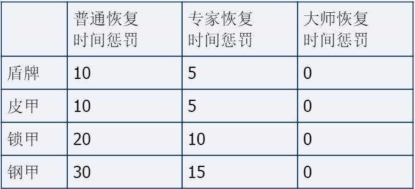
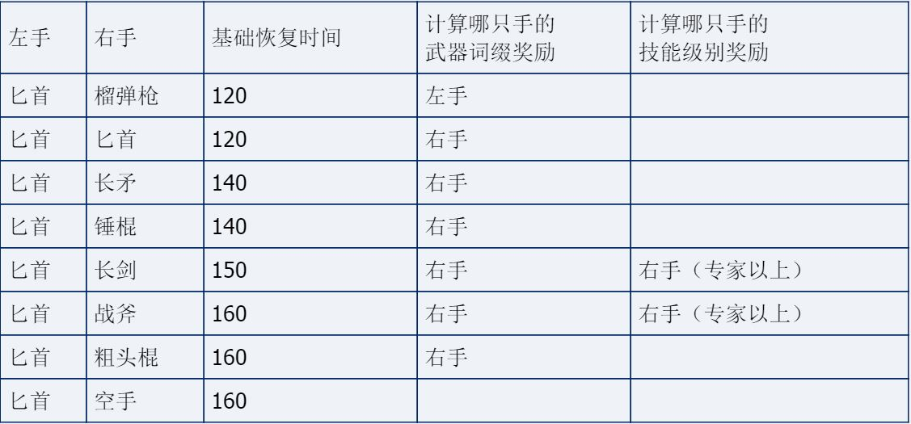
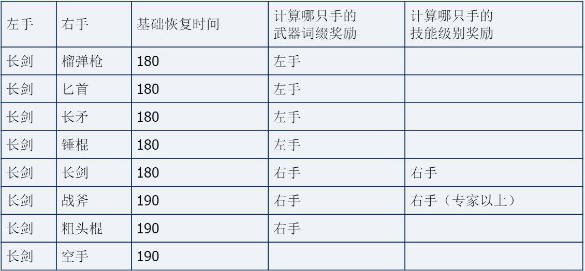
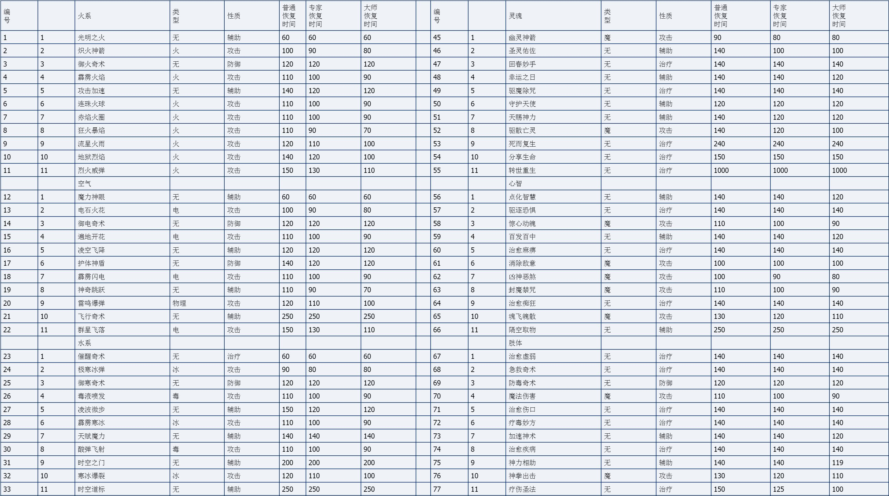
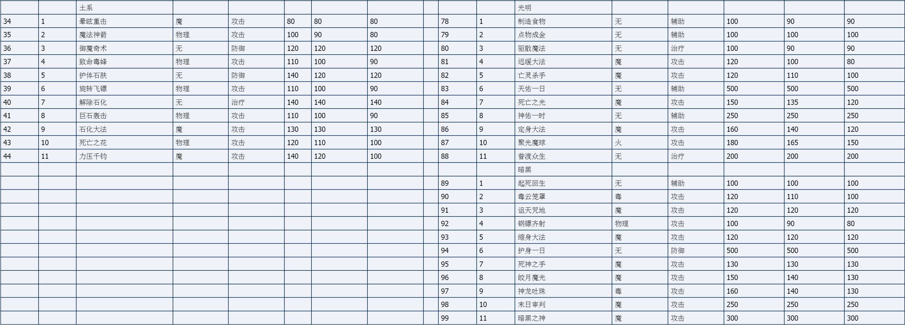

MM6恩报版课本-恢复时间学
===============================================================================
课前准备

首先，将我们在《基础数学》中学过的部分时间单位及其换算温习一下，记住前三个式子：

1BTU=1秒；

1分钟=60秒=60BTU；

1分钟=2地球秒；

（所以恢复时间为多少BTU，就意味着攻击60次花了多少分钟。乘以2就是地球秒）

1tick=1/128分钟；【由于不知道内存里能否看到当前某角色的近战、远程攻击和备用魔法的恢复时间，本人只得用变速齿轮和MM8LevelEditor 3.74测定其恢复时间：变速齿轮将游戏调慢后，释放魔法，或者攻击，然后立即保存游戏，再用MM8LevelEditor读取save文件察看该角色离下一轮行动（即宝石灯亮）还剩多少ticks，加1后换算成BTU。这种测定方法还算快捷，变速齿轮调1/64倍速的话，最后的结果误差最多也不可能超过1BTU（至多是tick换算成BTU时产生的误差。不过有点奇怪，游戏进行时，内存计时间用的也是tick或是tick/2为单位？那如是由BTU转换的话，在游戏中就已经产生微小的误差了？）】

【参考的MM6网站、文章有：
Bones' Combat Guide（http://www.angelfire.com/nt/bones/default.htm）
gladius：mm6攻速测试（http://www.gamerhome.net/bbs/viewthread.php?tid=163855&extra=page%3D5%26amp%3Bfilter%3Ddigest）
Bones' Combat Guide对恢复时间的测试数据非常全，我基本按照他的数据来写的。

同时也参考对照了：

阿基巴德：关于MM7的攻速再讨论（http://www.gamerhome.net/bbs/viewthread.php?tid=196437）】

记住了？好，相信你一定清楚，在战斗中，你攻击后、施展魔法后的恢复时间是越短越好，我们必须想尽办法不择手段地【包不包括bug、作弊和修改，由你自己决定了- -|||】使恢复时间短下来。否则时间越长，你出手的次数就会越少，杀敌的机会也大大减少。时刻想着一句话：越快越好，快了还会更快（Faster is better and faster gets better faster）。

我们即将讨论恩洛斯大陆上所有关于恢复时间的问题。但首先，我们要分武器和魔法两章来讲。其中魔杖是算在魔法里面的。其他攻击性的武器，包括空手搏击，都算在武器一章里。

另外，《恢复时间学》的内容在即时制下完全有效。回合制下的战斗恢复时间则十分混乱，请参见第三章其他中的bug一节。

我们开始吧！

一、武器
------------------------
1、武器恢复时间算法

武器基础恢复时间。一个字：查表。。。错了是两个字- -|||，表格在第2节单武器里；

武器恢复时间修正，即除基础时间外，其他影响武器恢复时间的有：

[1] 速度。回顾第一册《基础数学》中突破奖励点及其应用：攻击恢复时间的修正计算公式：-速度奖励值，单位：BTU。所以，有了速度，查突破奖励点表格，得到速度奖励值，则任何武器攻击的实际恢复时间都要减去这个速度奖励值。速度对任何武器攻击都有奖励。但是注意：现在我们正在讨论的是武器攻击，魔法的恢复时间和这个是没有关系的，下面的几个也是。

[2] 攻击加速魔法。-25BTU；

[3] 武器词缀奖励：
(1) 讯捷类（of Swiftness）【汗，简中翻的。。应为：“迅捷类”】：-20BTU；
(2) 暗黑类（of Darkness）（同时带有“迅捷类”、“吸血鬼”词缀属性）：-20BTU；
(3) 神器帕西佛：带有“迅捷类”词缀属性：-20BTU。
但是有时，比如说你的带词缀武器拿在左手上时，不一定会进行武器词缀奖励。请稍候看第3节：左右手武器。

[4] 武器技能级别奖励：
技能点奖励就是说某武器技能，每提升1技能级别，武器攻击时的恢复时间就会减少1BTU。在所有武器技能里，只有专家以上的长剑、战斧和弓箭有技能点奖励。远程的弓箭不用多说，关键是近战拿两把武器时，或是左手拿剑右手留空时，到底计算谁的技能级别奖励？这是个问题。这个将在第3节：左右手武器中详细讲述。

[5] 防具惩罚：
你拿起沉重的盾牌，穿上臃肿的盔甲的时候，你是否感到，你的身子骨正在下沉。。下沉。。。就连抬起胳膊都需要花更大的力气？的确，4种防具：盾牌、皮甲、锁甲、钢甲，在升至大师之前，对武器恢复时间都有惩罚性影响，武器实际恢复时间都要加上相应数值。但一旦到了大师水平，盔甲好似你身体的一部分的时候，它们就不会再对你有啥影响了。另外头盔皮带披风也无影响，具体数值见表格：

[6] 注意：奔跑或加速飞行无惩罚：
有小道消息说，按照恩塔格瑞大陆的定则，武器攻击的同时奔跑或加速飞行，会使武器的恢复时间乘以1.5。但是根据本书编写者的实地考察，恩塔格瑞大陆和恩洛斯大陆都没有任何的奔跑或加速飞行惩罚。【其实MM6的说明书里也说有惩罚，但偶测试结果表明没有。怀疑这个可能是bug。。】

综合起来，武器恢复时间的计算式为：
武器实际恢复时间=武器基础恢复时间-速度奖励值-25（如有攻击加速魔法的话）-20（如有武器词缀奖励的话）-特定武器技能级别（如特定的武器有技能级别奖励的话）+防具惩罚值（如装备有防具且未到大师的话），单位：BTU

但请注意，还有一个近身攻击的恢复时间限制：
所有近身攻击的武器，实际恢复时间不会小于30BTU，按计算式计算小于30BTU的，一律以30BTU计。两个远程武器——榴弹枪和弓箭则没有限制，恢复时间可以达到0BTU。

2、单武器（非左手）

正式讨论武器了。我们先讨论[1]右手单持武器；[2]双手单持武器；[3]远程武器，这3种情况，即所有除左手拿武器之外的情况。在讨论恢复时间时，这3种情况实际上就是1种。其中要说明的，我已经在下表里列出来了，表中留空的即为“无”；
粗头棍不需要学习技能天生就会，和空手搏击攻击发出的声音也一样，因此实际上算是空手搏击“技能”。但是为了方便列表，特将其分开。
两个远程武器：榴弹枪和弓箭同时装备时，弓箭被华丽地完全无视掉（但是弓箭可以做备用，在榴弹枪损坏时替补）；近身和远程是分开来的两种攻击形式，拥有不同的点数、伤害和恢复时间，弓箭仅为远程武器，不能像榴弹枪一样既近身又远程。

以下为恩洛斯所有武器列表，列出了近身武器（在其右手/双手单持武器时）与远程武器的恢复时间资料：

.. image:: 武器恢复时间表.jpg

3、左右手武器

匕首技能达到专家后，就可以左手持匕首了。以下为左手持匕首，右手持各种武器时的情况：

长剑技能达到大师后，方可左手持长剑。以下为左手持长剑，右手持各种武器时的情况：

基础恢复时间不用说了，说下“计算哪只手的武器词缀奖励”和“计算哪只手的技能级别奖励”栏：比如左长剑右战斧，“计算哪只手的武器词缀奖励”栏里是“右手”，那么一旦右手上的战斧有了“迅捷类”或类似词缀，就要进行武器词缀奖励，-20BTU；“计算哪只手的技能级别奖励”栏里是“右手（专家以上）”，那么一旦右手的战斧技能达到专家，就要进行战斧的武器技能级别奖励，每技能级别减1BTU。

从表里我们能看出（表缺)：

（这里约定一下，下文中的“单武器”，未特地指明“左手单武器”的，均指“非左手的单武器”。某武器单武器的基础恢复时间，即第2节列出的那些基础恢复时间）

左手持匕首时的基础恢复时间，等于两武器（右手空手也看作有武器）在单武器时的基础恢复时间之中，高的那个，再加上60（60就是单武器匕首的基础恢复时间）；

左手持长剑时，则是高的再加上90（90就是单武器长剑的基础恢复时间）；

我们计算的那两种奖励，总是那些在单武器时基础恢复时间高的武器的奖励，相同时则计算右手的。

不但要算基础恢复时间高的，还要再加上非左单武器长剑或匕首的时间！这直接导致了恩洛斯的战士同时拿两把武器时，基础恢复时间长得可怕。榴弹枪原来好端端地是30BTU，左手多拿把剑后，基础恢复时间猛窜到原来的6倍！！尽管你开的还是同一把枪- -！！！右手单持剑的，把剑拿到左手上去，立马暴增100BTU！因此在恩洛斯，几乎没有任何人愿意左手使用武器。有支恩洛斯民谣里唱道：“左手一支剑，右手一支枪，身上还背着一个胖媳妇呀，咿呀咿呀哟~~~~”这个民谣意思就是，你要是这样拿的话，你战斗时，就会“一哑”“一哑”哟。哪怕你的枪狂快，哪怕你的胖媳妇（帕西佛）带有“迅捷类”词缀属性也丝毫没有用（弓箭因榴弹枪而被完全无视，而此处的榴弹枪却又是左剑右枪合成的超慢速榴弹枪）。所以一般来说，是坚决不能用左手使用武器的。

4、与恩塔格瑞【MM7的大陆】的简单对比

【没装MM7，这里完全以阿基巴德：关于MM7的攻速再讨论（http://www.gamerhome.net/bbs/viewthread.php?tid=196437）的结论为准，错了可不是我的事（嘿嘿把责任都推到阿基头上，XE地坏笑ing。。。）不过大多数结论，他的和我这个MM6的还是一致的。】

【顺便教授一下几个地理名称：MM6的大陆叫恩洛斯；MM7的大陆的正式名称叫恩塔格瑞（也有直接把大陆唤作埃拉西亚的）。】

不同点：

[1] 左手持武器时基础恢复时间过长。【这个是一个近乎bug的非正常设定】恩洛斯的这个古怪现象造成了人们左手长期废弃不用，右脑萎缩的严重后果。在恩塔格瑞，左手单手拿武器时的基本恢复时间都变为100BTU，双武器时以基本恢复时间长的为准，不再加60或80，这是完全可以接受的。

[2] 回合制里恢复时间混乱。见下文第三章。【这个就是bug】

[3] 空手（包括粗头棍）的基础恢复时间，会空手搏击技能的恩塔格瑞人是60BTU；不会空手搏击技能的恩塔格瑞人是100BTU。恩洛斯则没有空手搏击术，都是100BTU。这导致恩洛斯功夫师、武术家们大量流失去了恩塔格瑞，也难怪恩塔格瑞的空手搏击术这么盛行。

[4] 没有武器使用术。恩塔格瑞大陆的武器增强技。恩洛斯人可能是觉得自己武器和魔法足够强了，人人都能上大师，所以没有去开发这项技能。

相同点：

6个恢复时间修正；奔跑或加速飞行无惩罚；除空手（包括粗头棍）外的所有基础恢复时间；近身攻击的恢复时间限制；左手拿武器时，计算单武器基础恢复时间高的武器的奖励，相同时则计算右手的。。。。。等等这些法则都是相同的。

二、魔法
------------------------
魔法恢复时间就没什么好讨论的了。普通级别的某魔法恢复时间一律相同，没有任何修正。速度、攻击加速魔法、魔法技能级别、防具都不影响魔法恢复时间。同一魔法的恢复时间只是在该魔法技能为普通、专家、大师级别时，才可能会有所差异，详见恩洛斯魔法恢复时间全表（单位：BTU）：

三、其他
------------------------
1、受击恢复时间

受击恢复时间，即受到敌人攻击后惩罚的恢复时间。不论什么敌人攻击你，受击恢复时间基础值都为：20BTU。用于修正的也只有一个量：耐力奖励值（请查阅突破奖励点表格）。
受击恢复时间完全计算式如下（单位：BTU）：
受击恢复时间=受击恢复时间基础值20-角色耐力奖励值

【MM6一个著名的恼人的bug：某人耐力大于或等于400时，被敌方有效攻击就会显示“在2118的D:\MM6Src\code\PARTY.CPP中判断失败”，并跳出游戏。
这就是因为，耐力大于或等于400时，耐力奖励值大于20，实际受击恢复时间就会为负，导致程序判断失败。
英文1.2版修复了此bug，负恢复时间一律看作0。】

【又是bug：MM6的康复类（of Recovery）后缀物品说是“伤害恢复时间减10（(-10) pts on recovery from being hit）”，但是我测试了1.0简体中文和1.2英文版本，发现不论是攻击恢复时间，还是受击恢复时间，不论是武器的，还是魔法的，都不变。1.1升级补丁readme里说修复了这个bug，难道1.2又有这个bug了？】

另外，你攻击怪物，怪物的受击恢复时间也是这样算的。这使你有可能打他个措手不及，根本没有出手的机会。详见下一节。

2、恢复时间叠加

在还未恢复过来的时候受到攻击，时间不是简单叠加，而是以恢复过来较晚的计算，相当于覆盖。比如，在还有50BTU恢复行动时受到攻击，且受击恢复时间为20BTU，那么还按50BTU计算。

一种近似连击的打法：
如果你的一个角色用恢复时间少于20BTU的远程武器攻击某一个怪物，那么你的攻击能使怪物恢复行动的时间推迟20BTU，而在它恢复过来前，你先恢复了行动，于是再次攻击它，再次使它恢复推迟20BTU，于是怪物根本没有出手的机会。
但是，只有远程武器（弓箭、榴弹枪）才能达到20BTU恢复时间，近身武器有30BTU的下限。所以，一旦怪物靠近，弓箭不管用了还是没用。只有榴弹枪才可以真正打出近似连击。但实际上榴弹枪是很容易达到0BTU的，这个看下一节的分析。

【又一个bug：绝食大咪咪。某角色未恢复行动时，想方设法选中这个角色（比如可以打开可行动者的状态/物品栏，然后切换到不可行动者，等等），然后就又能攻击了，即使他还没恢复行动。此bug的恢复时间，也是以恢复过来较晚的计算。】

3、0BTU分析

【这里参考了男狼的MM7 0BTU弓箭的实现方法（附加榴弹枪资料）（http://www.cwebgame.com/viewthread.php?tid=89215&extra=page%3D1%26amp%3Bfilter%3Ddigest），特此感谢】
【不讨论NWC里JVC闺房的七项指标全加256的方块，以及所有有益的bug】
传说中的0BTU，指的就是某种攻击完全用不着恢复时间，唰唰唰唰连续攻击可怜的敌人，射箭就像泼水一样（见图）的境界。
攻击恢复时间为0BTU的，显然不可能是魔法（查下表格就知道），也不可能是近身武器（近身武器有30BTU的强制下限），只能是远程武器弓箭，和远程兼近身武器榴弹枪。

[1] 弓箭

弓箭的基础恢复时间为100BTU。争取在下面5个修正中，把100全减掉。

5个恢复时间修正：

1. 速度。每点速度突破奖励值减1BTU。

能加速度的有：

游戏一开始自定义角色，速度最大加到25；

银湾城镇西南岛井水永久加速度，但最大加到15（没上一项高）；

- 紫色酒桶：+1速度；
- 黑色药剂速度精髓：+15速度，-5个性；
- 6月使用命运台：6月第一周使用命运台+1速度；第二周+2；第三周+；第四周+4。
- 6月速度神庙（幽灵沼泽东部）：第一次+10速度；
- 众神之庙（飞龙沙漠东部小岛）：永久+20速度等七项指标与五项抗性；
- 飞龙沙漠东岛泉水：永久+10速度等七项指标[消灭]

- 众神类（多个不叠加）：+10速度等七项指标；
- 毁灭类（多个不叠加）：+1速度等七项指标、生命值、魔力值、防御等级、四元素抗性；
- 歹徒类（多个不叠加）：+10速度和精确；
- 天空类（多个不叠加）：+10速度、智力、魔力值；
- 靴子露希斯：+30速度；
- 靴子赫尔姆斯（与上一项靴子露希斯不能同时穿）：+100速度，-40命中率；
- 速度类后缀物品：加的速度值不定，一般高的大约25左右；

- 肢体魔法加速神术：+速度：肢体普通10+2/级；专家10+3/级；
- 光明魔法天佑一日，里面包含了增强版的加速神术（与上一项天佑一日不叠加）：+速度等七项指标：光明普通10+2/级；专家10+3/级；大师10+4/级；

- 临时泉水（不叠加）中，加速度最多的是：甜水镇东南泉：临时+50速度等七项指标。

算一下非常非常理想的情况：25（一开始）+10（紫色酒桶，算你能够找到10个，且都加在一人头上）+15（黑药剂速度精髓）+4（6月第四周命运台）+10（6月速度神庙）+20（众神之庙）+10（飞龙沙漠东岛泉水）+10（众神类物品）+1（毁灭类）+10（歹徒类）+10（天空类）+100（靴子赫尔姆斯）+50（就算能有2个+25的速度类后缀物品）+90（光明魔法天佑一日，就算大师20级）+50（甜水镇东南泉）=415

415点速度的突破奖励值为：25。减25BTU。

2. 攻击加速魔法。肯定要加，减25BTU；

3. 武器词缀奖励。争取弄到迅捷弓、暗黑弓，甚至神器帕西佛，减20BTU。

4. 弓箭技能级别奖励。专家后每级减1BTU。

能加弓箭技能级别的有：

恩洛斯大陆上总共30个马蹄铁（有时会更多）+60技能点数；

训练升级获得技能点数，升到x级获得的技能点数=INT(x/10+5)，INT为向下取整函数。比如38级，38/10+5=8.8，再向下取整为8，即升到38级获得8技能点数；

没有任何NPC能够提升弓箭技能级别。

5. 4种防具。如果装备了的话就拿下（大师无惩罚，就无所谓了），保证没有4种防具的恢复时间惩罚。

其中2、3项减掉了45BTU，还剩55BTU。如果速度真的能像上面说的那样达到400多点，减25BTU的话，弓箭（专家）必须30级以上，减30BTU。弓箭30级需要464技能点数，这意味着30个马蹄铁全用了，还要404技能点数。必须至少升到55级（55级总共加起来得到405技能点数），然后全部用于弓箭（其实上面光明魔法算的是大师20级，所以光明魔法至少也要分些技能点数）
所以恩洛斯的弓箭0BTU，比恩塔格瑞大陆难得多。当然如果你不在乎拯救恩洛斯所花的时间的话，慢慢练经验，升到比如说183级，得到总共2517技能点数，那么这样弓箭0BTU就很有可能了。

另外实际上弓箭恢复时间1BTU、2BTU的效果，和0BTU基本上差不多。

[2] 榴弹枪

榴弹枪的基础恢复时间为30BTU。如果已经有25点的速度值，再加上1个攻击加速魔法，就能轻易达到0BTU，所以就不再细说了。

假如右手榴弹枪，左手匕首或长剑的话，基础恢复时间会达到暴大的120BTU或180BTU，而且还没有任何的技能级别奖励，所以完全没有可能达到0BTU。

4、武器发出的声音

好像和恢复时间没什么关系。不过倘若用累积法测恢复时间的话，你还是需要拥有一根对武器声音敏感的神经的。

锤棍、粗头棍和空手攻击发出同样的声音，其他均各自不同；

长矛单双手发出同样的声音；

武器装备于左手时不发声，只有装备于右手/双手才发声，比如：武器装备于左手，右手空手的话，发空手的声音。

5、怪物攻击恢复时间一览

怪物有1类攻击和2类攻击，其中有近身有远程，但恢复时间，对同种怪物来说都是一致的。但怪物的魔法攻击恢复时间还是要看其施用的魔法本身。

下面是恩洛斯所有怪物攻击（不包括魔法）恢复时间一览表：

.. image:: 怪物受攻击恢复时间表.JPG

特殊生物：

.. image:: 特殊怪物受攻击恢复时间表.JPG

